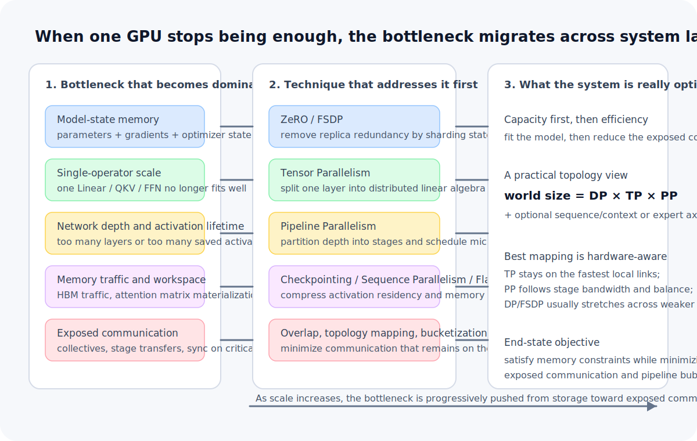

# How Do We Train a Model That No Longer Fits on One GPU?

<BlogPostLocaleSwitch current-locale="en" zh-path="/blog/engineering_system_view/training-models-larger-than-one-gpu" en-path="/blog/engineering_system_view/training-models-larger-than-one-gpu-en" />

When a model still fits cleanly on one GPU, training is primarily an optimization problem. Once it crosses the single-device boundary, it first becomes a systems problem. What must now be redesigned is not only the optimizer recipe, but the placement of training state, the decomposition of layer computations, and the extent to which synchronization can be hidden behind useful work.

That is why the most accurate answer to "how are large models trained?" should not begin with a framework name. It should begin with the migration path of bottlenecks. In real systems, the bottleneck moves from single-device memory to model-state placement, then to operator decomposition, pipeline scheduling, and finally exposed communication. ZeRO/FSDP, tensor parallelism, pipeline parallelism, mixed precision, checkpointing, and FlashAttention are not interchangeable items on a technique list. They are successive mechanisms that take over different layers of the system under different constraints [1-6].

> Core claim: once a model grows beyond a single GPU, the problem is not "how many GPUs can we add?" but "how do we rewrite the single-device assumption?" Engineering-wise, large-model training must answer three separate questions: how model state is distributed, how individual computations are decomposed, and how communication is reduced, overlapped, or otherwise made tolerable. Scale-up is the process of pushing the bottleneck from the model layer into the system layer.

In the "Engineering and Systems Perspectives" series, this article follows that evolution path and asks what actually changes once a model no longer fits on one GPU. To return to the topic overview, use [Blog](/blog/).

*Figure 1. Once the single-device assumption fails, the training stack moves its dominant bottleneck across model-state storage, operator execution, network depth, activation memory, and exposed communication. The main techniques do not replace one another; they take over different layers of the system.*

## 1. What exactly breaks at the single-GPU boundary?

GPU memory must host more than parameters. A more faithful training-side accounting is

$$
M_{\text{device}}
\approx
M_{\text{param}}
+
M_{\text{grad}}
+
M_{\text{optim}}
+
M_{\text{act}}.
$$

These terms correspond to parameters, gradients, optimizer state, and activations. In large training runs, the first term is often not even the one that dominates.

- With Adam-like optimizers, `m` and `v` can make optimizer state a major component.
- If master weights are retained, non-activation model state can exceed raw parameter storage by a wide margin.
- If sequence length grows, activations and attention workspaces can become the next hard wall.

Under a common recipe, for example `BF16` parameters and gradients with Adam moments and possibly master weights kept in `FP32`, the **persistent parameter-related state alone** is often already on the order of low double-digit bytes per parameter. The exact figure varies by implementation, but the order of magnitude is stable. That is enough to make the static state cost of 10B-100B+ parameter models a single-device non-starter even before activations dominate.

So the first hard limit in large-model training is usually not representational power or optimization theory. It is whether the full training state can physically reside on device at all. That is why many jobs fail first with `CUDA out of memory`, not with bad loss curves.

## 2. Why bigger GPUs and data parallelism are both insufficient

Moving to a larger GPU is usually the first response, but it only delays the problem. Single-device memory is a hard boundary. If model size, sequence length, and training state keep increasing, that boundary will be hit again.

The next obvious move is multi-GPU training, most often standard data parallelism. Data parallelism is essential, but it is important to say precisely what it solves and what it does not.

It does solve:

- distributing samples from a step across devices, increasing throughput;
- parallelizing the same training step across multiple replicas, reducing wall-clock time.

It does not solve:

- the existence of a full model replica on every device;
- the static memory footprint of parameters, gradients, and optimizer state per replica.

More precisely, under a fixed global batch, data parallelism can reduce activation pressure per device because the local batch shrinks. But **it does not fundamentally de-replicate model state**. So data parallelism is primarily a throughput-scaling technique, not a principled way to break the single-device model-capacity limit.

At this point it is essential to separate two different goals:

- `scale out compute`: train the same model faster;
- `break single-device capacity`: make the model fit at all.

The first is mostly a data-parallel story. The second needs a different class of techniques.

## 3. The first real step beyond single-device capacity: state sharding

Once the failure mode is clearly "every GPU is storing almost the same state," the problem changes from multi-GPU execution to model-state sharding. The core idea of ZeRO is exactly to remove that redundancy: Stage 1 shards optimizer state, Stage 2 adds gradient sharding, and Stage 3 further shards the parameters themselves [1]. From a systems perspective, full-shard FSDP belongs to the same design family.

The essence of this step is not "many GPUs train together." It is "many GPUs store the state together." If a sharding group contains $N$ devices, then the sharded part of model state moves from "one full copy per device" toward roughly "one-$N$th per device" in steady state. That is the point at which model size genuinely starts to move beyond the single-card boundary.

But the gain comes from giving up local immediacy:

- parameters may need to be `all-gather`ed just before layer execution;
- gradients may need `reduce-scatter` or equivalent synchronization after backward;
- optimizer updates must be reflected back into the sharded parameter view.

So state sharding should be understood as rewriting a memory constraint into a communication constraint. The model now fits, but the system becomes more dependent on interconnect quality, synchronization timing, and communication overlap. That is why ZeRO/FSDP is best understood first as a capacity unlocker, not as a free speedup mechanism.

## 4. When even one layer is too large: tensor parallelism

State sharding solves where model state lives. It does not automatically solve how a large operator is executed. As the model widens, the next wall is often that one `Linear`, one `QKV` projection, or one large FFN matrix is itself no longer a comfortable single-device computation.

That is the problem tensor parallelism addresses. It splits the operator itself across tensor dimensions so that multiple GPUs cooperate on a single layer computation. Megatron-LM made these row-parallel and column-parallel decompositions standard practice for Transformer layers [2]. The objective here is not batch-dimension throughput. It is operator-scale feasibility.

This form of parallelism has a very specific systems signature: communication is finer-grained and more frequent. Once a layer is split, collective operations such as `all-reduce` and `all-gather` appear at layer boundaries or inside layer execution. As a result, tensor parallelism typically prefers a fast local interconnect domain, such as NVLink or NVSwitch, rather than slow cross-node links for fine-grained decomposition.

So tensor parallelism is not "many copies of the model training together." It is "one layer of one model being executed in distributed linear algebra form." That is why it behaves very differently from data parallelism.

## 5. When the model is too deep: pipeline parallelism

If the model is not only wide but also very deep, then even when each layer is individually executable, the full stack of layers may still be too large for a single device group to host efficiently. The problem is then no longer only operator size. It is network depth and activation lifetime. Pipeline parallelism answers this by partitioning the network along layers into stages and feeding micro-batches through those stages as a pipeline [3].

It solves two things at once:

- each device group hosts only part of the network depth;
- multiple micro-batches keep different stages busy at the same time.

But pipeline parallelism is not merely "split the layers and move on." The true engineering difficulty sits in three places:

- bubble: the pipeline has unavoidable fill and drain inefficiency;
- load balance: an imbalanced stage partition directly slows the entire pipeline;
- activation scheduling: forward/backward interleaving shapes both memory use and latency, which is exactly the setting in which schedules such as 1F1B and systems such as PipeDream become relevant [3][9].

So pipeline parallelism is fundamentally a scheduling problem. The model becomes trainable, but the system is now optimizing stage partitioning, micro-batch count, and schedules such as 1F1B rather than simply replicating the same computation.

## 6. The techniques that often push the system farthest are orthogonal ones

Once state sharding, tensor parallelism, and pipeline parallelism are in place, training usually stops being about finding one more dramatic idea. It becomes a process of compressing representation cost, activation residency, and memory traffic. The most important techniques at this stage tend to be orthogonal and composable.

### Mixed precision

Mixed precision reallocates the numeric budget. `FP16` reduces memory and bandwidth substantially but has a narrower dynamic range and often needs loss scaling. `BF16` preserves the exponent range of `FP32`, which is why it has become the more common default in large-model training. `FP8` pushes cost reduction further, but it remains strongly dependent on hardware support, kernels, and recipe stability [4].

### Activation checkpointing and selective recomputation

Checkpointing is not a small memory tweak. It is an explicit decision not to keep some intermediate activations resident, and instead to recompute them during backward. It is the canonical trade of extra compute for lower memory footprint, and one of the most effective activation-memory tools in large-scale training [5]. In more mature large-model stacks, this is often refined into selective recomputation rather than blanket replay of every layer, so that memory savings do not translate one-for-one into redundant FLOPs [8].

### Sequence parallelism

When the dominant pressure comes from activations rather than parameters, systems often add another axis: sequence parallelism. The basic idea is that once tensor parallelism is already present, keeping full-sequence activations replicated in certain non-tensor-parallel parts of the block is itself a form of waste. Sharding those states further along the sequence dimension reduces activation memory and decreases how much recomputation is needed merely to stay within memory limits [8]. This becomes especially important in long-context training, where the first wall is often not parameter count but sequence-dependent activations and attention workspace.

### FlashAttention and IO-aware kernels

FlashAttention does not turn dense exact attention from quadratic arithmetic into linear arithmetic. The more precise statement is that it uses tiling and IO-aware design to avoid materializing the full $N \times N$ attention matrix in high-bandwidth memory, thereby reducing memory traffic and workspace pressure [6]. For long-context training, this distinction matters: the win is not merely "less memory," but less expensive memory movement.

These methods matter because they attack different parts of the system:

- mixed precision compresses representation cost;
- checkpointing reduces activation residency;
- IO-aware kernels reduce memory traffic and temporary storage.

Individually, none of them looks like a total redesign. In aggregate, they often determine whether a training job is merely plausible or actually runnable.

## 7. At scale, the real bottleneck is often exposed communication

Once multiple forms of parallelism are active, step time is no longer driven mainly by raw FLOPS. It is driven by how much communication remains exposed on the critical path. A more realistic systems abstraction is

$$
T_{\text{step}}
\approx
T_{\text{compute}}
+
T_{\text{comm, exposed}}
+
T_{\text{bubble}}
+
T_{\text{misc}}.
$$

The important quantity is not total communication volume alone. It is **exposed communication**. If communication can be overlapped with useful compute, its wall-clock cost drops sharply. If it cannot, it becomes step time directly.

Different parallel strategies expose different communication patterns:

- data parallelism exposes gradient synchronization;
- state sharding exposes parameter `all-gather` and gradient `reduce-scatter`;
- tensor parallelism exposes intra-layer collectives;
- pipeline parallelism exposes point-to-point activation transfer across stages.

That is why serious training systems do not stop at choosing a parallelism recipe. They repeatedly tune bucket sizes, overlap strategies, topology placement, gradient accumulation, and stage mapping. Having many GPUs is not the same thing as having a strong training system. Device count matters only if the communication system is organized well enough to convert those devices into effective throughput.

## 8. Real large-model training is a hybrid system, not a single method

In practice, few large systems succeed with one parallel strategy alone. A more realistic stack is

`data parallelism × ZeRO/FSDP × tensor parallelism × pipeline parallelism + BF16/FP16 + checkpointing + FlashAttention`

Each component answers a different bottleneck:

- data parallelism scales throughput;
- ZeRO/FSDP removes redundant model-state replicas;
- tensor parallelism decomposes oversized layer operators;
- pipeline parallelism decomposes network depth;
- mixed precision, checkpointing, and efficient kernels keep squeezing memory and bandwidth.

From a more systems-oriented viewpoint, the process topology of a large dense Transformer is often written as

$$
\text{world size}
=
DP \times TP \times PP,
$$

where `DP` is data parallelism, `TP` tensor parallelism, and `PP` pipeline parallelism. If sequence/context parallelism or expert parallelism for MoE models is added, the factorization becomes higher-dimensional [7][8]. At that point, the important issue is no longer the number of names, but **how those axes map onto the physical topology**:

- `TP` is the most sensitive to low-latency, high-bandwidth links, so it is usually kept within a fast local domain;
- `PP` cares about point-to-point bandwidth and stage balance between adjacent partitions;
- `DP` or `FSDP/ZeRO` often becomes the outer scaling axis and can tolerate comparatively weaker cross-node links.

That is why a large-model training stack should be read less as a feature list and more as a bottleneck map. Once the model is large enough, hybrid parallelism is not aesthetic complexity. It is the natural outcome of simultaneously facing capacity, throughput, depth, and communication constraints.

Written more formally, the systems objective can be approximated as

$$
\min_{\text{parallel plan}} \ T_{\text{step}}
\quad
\text{s.t.}
\quad
M_{\text{device}} \le M_{\text{budget}},
\quad
T_{\text{comm, exposed}} \text{ is minimized},
\quad
T_{\text{bubble}} \text{ remains controlled}.
$$

Here the `parallel plan` includes parallel-axis factorization, topology mapping, recomputation strategy, and kernel choice. In other words, the real engineering problem is not whether to use one particular method, but how to find a decomposition that satisfies memory limits while minimizing exposed communication and maximizing throughput on the actual hardware topology.

To make those boundaries explicit, Table 1 compresses the major techniques into one systems view.

| Technique | Primarily solves | Does not directly solve | Main cost |
| --- | --- | --- | --- |
| Data parallelism | Throughput scaling on the sample axis | Single-device model-state capacity | Gradient synchronization |
| ZeRO / FSDP | Redundant storage of parameters, gradients, and optimizer state | Oversized individual operators | More frequent parameter/gradient communication |
| Tensor parallelism | Operator-scale capacity and compute limits | Excessive network depth | Intra-layer collectives |
| Pipeline parallelism | Network depth and staged model placement | Oversized intra-layer operators | Bubble, stage imbalance, scheduling complexity |
| Checkpointing / selective recomputation | Persistent activation memory | Redundant model-state replicas | Extra recompute |
| Sequence parallelism | Sequence-related activation redundancy | Parameter-state memory | Another parallel axis plus associated communication |
| FlashAttention / IO-aware kernels | Attention memory traffic and workspace pressure | State sharding or network-depth limits | Kernel and implementation complexity |
| Communication overlap / topology mapping | Exposed communication on the critical path | The underlying capacity limit itself | Tuning complexity and topology coupling |

## 9. Scale-up is not unbounded growth. It is bottleneck migration into the system layer

Intuitively, it can seem as though we should be able to keep adding machines forever and keep growing the model. In reality, several limits do not go away:

- latency has a physical floor;
- synchronization efficiency degrades with scale;
- failures, restarts, and straggler effects become more important;
- budget, power, and network infrastructure remain hard ceilings.

So the realistic statement is not that scale-up is infinite. It is that **we keep pushing the bottleneck from the model layer into the system layer**. First it is memory capacity, then state placement, then operator decomposition, then scheduling and communication hiding. Whether the model can continue growing is ultimately a question about whether the full training system can absorb that complexity.

## 10. Closing

Once a model no longer fits on one GPU, the training problem is no longer just "is the architecture good?" It becomes a repeated answer to three more fundamental engineering questions:

- how should model state be distributed;
- how should layer-level and network-level computation be decomposed;
- can the communication cost still be sustained and hidden?

That is why large-model training rarely has a silver bullet. What actually trains the model is not a framework name by itself, but an engineering process that repeatedly redraws the system boundary around memory, compute, and communication.

Return to the topic overview: [Blog](/blog/).

## References

[1] RAJBHANDARI S, RASLEY J, RUWASE O, et al. ZeRO: Memory Optimizations Toward Training Trillion Parameter Models[J]. *arXiv preprint arXiv:1910.02054*, 2020. DOI: [10.48550/arXiv.1910.02054](https://doi.org/10.48550/arXiv.1910.02054).

[2] SHOEYBI M, PATWARY M, PURI R, et al. Megatron-LM: Training Multi-Billion Parameter Language Models Using Model Parallelism[J]. *arXiv preprint arXiv:1909.08053*, 2019. DOI: [10.48550/arXiv.1909.08053](https://doi.org/10.48550/arXiv.1909.08053).

[3] HUANG Y, CHENG Y, CHEN D, et al. GPipe: Efficient Training of Giant Neural Networks using Pipeline Parallelism[J]. *arXiv preprint arXiv:1811.06965*, 2018. DOI: [10.48550/arXiv.1811.06965](https://doi.org/10.48550/arXiv.1811.06965).

[4] MICIKEVICIUS P, NARANG S, ALBEN J, et al. Mixed Precision Training[J]. *arXiv preprint arXiv:1710.03740*, 2017. DOI: [10.48550/arXiv.1710.03740](https://doi.org/10.48550/arXiv.1710.03740).

[5] CHEN T, XU B, ZHANG C, et al. Training Deep Nets with Sublinear Memory Cost[J]. *arXiv preprint arXiv:1604.06174*, 2016. DOI: [10.48550/arXiv.1604.06174](https://doi.org/10.48550/arXiv.1604.06174).

[6] DAO T, FU D Y, ERMON S, et al. FlashAttention: Fast and Memory-Efficient Exact Attention with IO-Awareness[J]. *arXiv preprint arXiv:2205.14135*, 2022. DOI: [10.48550/arXiv.2205.14135](https://doi.org/10.48550/arXiv.2205.14135).

[7] NARAYANAN D, SHOEYBI M, CASPER J, et al. Efficient Large-Scale Language Model Training on GPU Clusters Using Megatron-LM[C]// *Proceedings of the International Conference for High Performance Computing, Networking, Storage and Analysis*. New York: ACM, 2021. DOI: [10.1145/3458817.3476209](https://doi.org/10.1145/3458817.3476209).

[8] KORTHIKANTI V A, CASPER J, LYM S, et al. Reducing Activation Recomputation in Large Transformer Models[J]. *arXiv preprint arXiv:2205.05198*, 2022. DOI: [10.48550/arXiv.2205.05198](https://doi.org/10.48550/arXiv.2205.05198).

[9] NARAYANAN D, HARLAP A, PHAN N, et al. PipeDream: Generalized Pipeline Parallelism for DNN Training[C]// *Proceedings of the 27th ACM Symposium on Operating Systems Principles*. New York: ACM, 2019. DOI: [10.1145/3341301.3359646](https://doi.org/10.1145/3341301.3359646).
