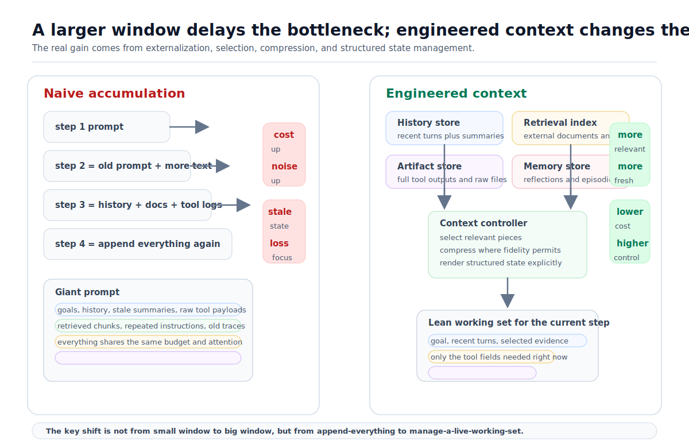
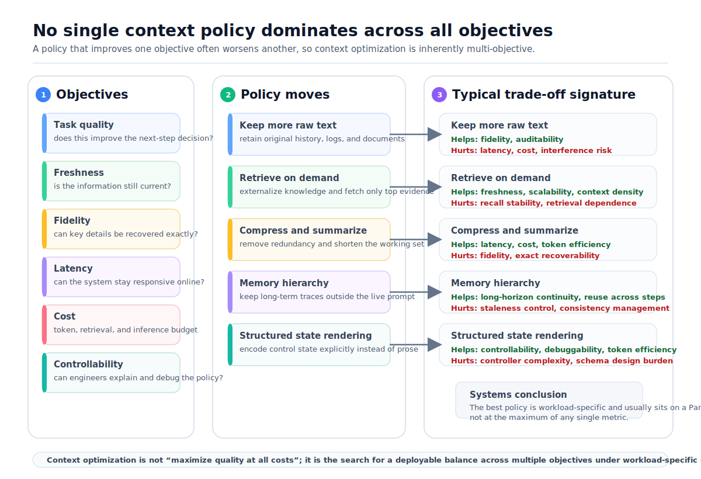

# AI Agent 的上下文工程：当上下文不断膨胀时，我们到底在优化什么？

<BlogPostLocaleSwitch current-locale="zh" zh-path="/blog/engineering_system_view/what-are-we-optimizing-in-agent-context" en-path="/blog/engineering_system_view/what-are-we-optimizing-in-agent-context-en" />

当大模型只做单轮问答时，prompt 看起来像一段输入文本；到了 AI Agent 系统里，它更像模型在当前 step 看到的**运行时工作集**。用户目标、历史对话、检索文档、工具返回、执行轨迹、反思记录和任务状态，都要在一次调用前被组织成一个可送入模型的上下文。

这使得问题的性质发生了变化。Agent 的能力不再只由模型参数、推理技巧或工具集合决定，同样取决于系统在每一步究竟把什么信息送进模型。一旦这一层构造做得不好，即使 context window 更大，Agent 也可能在无关信息里迷失、在关键位置上失焦，或者因为压缩过度而丢失决策所需细节 [1-3]。工程实践里，系统往往不是缺少信息，而是缺少一种能在有限预算内稳定选出正确信息、并以正确形式呈现给模型的机制。

> 核心结论：更大的 context window 只是扩大了 Agent 的“工作内存容量”，却不会自动完成信息管理。Context engineering 真正要解决的不是单纯扩容，而是在任务效果、token 成本、检索与推理时延、信息完整性、时效性与系统可控性等约束下，决定哪些信息进入当前工作集、哪些被压缩、哪些留在外部记忆中按需取回，以及哪些必须被淘汰。

在“工程和系统视角”系列中，本文尝试把这个问题重新表述为一个系统工程问题：context engineering 不是单纯的 prompt 编写技巧，而是围绕运行时信息流展开的工作集管理、缓存分层、状态表示与上下文策略设计问题。换句话说，prompt 往往只是 `context policy` 的最终渲染结果，而不是问题本身；若想回到专题入口，可从 [Blog](/blog/) 继续按系列浏览。

文中若不特别区分，`context engineering` 指系统层面的整体设计问题，`context optimization` 指其中围绕目标与约束的求优问题，`context policy` 指具体到一次调用或一类任务上的上下文构造规则。三者相关，但不等价。

*图 1. 在 Agent 系统中，prompt 不是对输入文本的简单累加，而是控制器在当前 step 上从多路状态中选择、压缩并渲染出的工作集。*

## 1. 把 Context 看成 Agent 的运行时工作集

如果把 Agent 在时刻 $t$ 的一次模型调用写成一个更系统化的抽象，可以近似记为

$$
C_t
=
\mathrm{render}(u_t, H_t, R_t, O_t, M_t, s_t; B_t),
$$

其中：

- $u_t$ 是当前用户输入或当前子任务目标；
- $H_t$ 是对话历史；
- $R_t$ 是检索得到的外部文档；
- $O_t$ 是工具调用或环境交互产生的 observation；
- $M_t$ 是从长期记忆中取回的经验或摘要；
- $s_t$ 是结构化任务状态；
- $B_t$ 是当前 step 可用的 token、延迟和成本预算。

这里最关键的不是“模型收到了一段文本”，而是**系统先把异构状态渲染成了一段文本**。更严格地说，prompt 并不等于状态本身，而只是状态在当前调用上的一个视图。在传统软件里，运行时状态可能分散在堆内存、缓存、日志、数据库会话和任务对象里；而在 LLM Agent 中，这些异构状态常常被统一序列化为 token，再通过同一条输入通道送入模型。

因此，context window 在系统角色上很像一块昂贵而有限的工作内存。真正困难的步骤不是 `LLM inference` 本身，而是推理之前的 `context construction`：系统必须决定哪些历史需要保留，哪些外部信息需要检索，哪些工具输出要进入 prompt，哪些状态应该留在外部系统里而不是全文复制进上下文 [4-8]。这里的 `render` 也绝不只是字符串拼接，它通常同时包含排序、截断、摘要、模板填充、结构化字段展开与来源编排。

如果把 Agent 每一步的目标进一步写成一个约束优化问题，它更接近

$$
\max_{C_t} \Pr(a_t^\star \mid C_t)
\quad
\text{s.t.}
\quad
|C_t| \le B_t,
\quad
\mathrm{latency}(C_t) \le \tau_t,
$$

其中 $a_t^\star$ 可以理解为“当前 step 的正确回答、正确动作或正确工具调用”。这说明 context engineering 的核心目标并不是“尽可能多地塞信息”，而是在预算约束下，构造一个**最有助于下一步决策**的工作集。系统真正优化的不是上下文长度本身，而是“在给定预算下，当前工作集对下一步决策质量的边际贡献”。

## 2. 更大的 Context Window，为什么不是根本解法？

直觉上，既然问题来自上下文不够大，那么把 window 继续做大似乎就是自然答案。但从系统视角看，这个答案并不充分。

第一，长上下文从来不是免费的。在标准 Transformer 中，自注意力的计算和显存开销会随序列长度快速上升 [1]。即使后续模型和 kernel 已经把长上下文处理能力显著向前推进，更长输入仍然意味着更高的推理成本、更长的 wall-clock latency 和更大的服务预算压力。

第二，**可容纳更多 token** 不等于 **能稳健利用更多 token**。Liu 等人在 `Lost in the Middle` 中系统展示过：即使是显式支持长上下文的模型，当关键信息位于输入中部时，性能也可能显著下降；相关信息位于开头或结尾时，模型往往更容易利用 [2]。这说明 context engineering 面对的不只是容量问题，还有位置偏置、注意力分配和信息密度问题。

第三，更长窗口甚至可能不是当前 step 的最优表示。LongLLMLingua、LLMLingua 和 Selective Context 的结果都说明：在不少长上下文任务里，对 prompt 做有针对性的压缩或剪枝，不仅可以降低 token 成本，还可能提升最终性能 [3][9][10]。换句话说，**更多信息并不自动转化为更多有效信息**；当无关信息和冗余表达持续增长时，更大的窗口只是让系统有机会塞进更多噪声。

所以，window expansion 的作用更准确地说是：它推迟了容量瓶颈，却没有替代信息管理。Agent 真正面对的仍然是工作集设计问题，而不是单纯的容量扩容问题。窗口大小只是 `capacity parameter`，而不是能够自动给出优良上下文策略的 `policy parameter`。

*图 2. 单纯扩大 window 只能延后 prompt 膨胀；更系统的做法是把大部分信息留在外部存储里，通过检索、压缩和结构化渲染构造当前 step 的最小有效工作集。*

## 3. Context Optimization 是一个多目标约束问题

如果把这个问题讲得更精确，context optimization 并不是寻找某个单一意义上的“最佳 prompt”，而是在多个彼此冲突的目标之间寻找可接受平衡。一个更贴近工程现实的抽象是：

$$
\max_{C_t \in \mathcal{F}_t}
\Big(
Q_t(C_t),
F_t(C_t),
R_t(C_t),
S_t(C_t),
-L_t(C_t),
-K_t(C_t)
\Big),
$$

其中 $Q_t$ 表示当前 step 的任务质量，$F_t$ 表示 freshness，$R_t$ 表示 fidelity，$S_t$ 表示稳定性与可控性，$L_t$ 表示 latency，$K_t$ 表示总体成本。现实系统追求的通常不是某个标量指标上的单点最优，而是在具体 workload 与服务预算下更接近 Pareto-efficient 的一组上下文策略。

*图 3. 不同的 context policy 会同时改善和损害不同目标，因此上下文优化不是单指标竞赛，而是 workload 相关的多目标折中。*

### 3.1 Relevance：当前 step 真的需要什么？

Agent 并不需要“尽量完整的过去”，而只需要“对当前决策最有用的过去”。对话历史、检索文档、工具结果和记忆记录，都必须围绕当前 step 的决策边界重新排序。只要把无关信息一并放进 prompt，模型就不得不在有限注意力里同时处理噪声和信号。

### 3.2 Freshness：这些信息是不是已经过时？

对 Agent 来说，知识并不都来自静态语料。很多任务依赖搜索结果、数据库状态、网页内容、API 返回和多轮执行过程中的新 observation。RAG 的价值并不只是在“补知识”，也在于把知识从参数里外置，从而获得更好的可更新性和来源可追溯性 [4]。但只要系统继续缓存旧摘要、旧检索结果或旧任务状态，prompt 里就会出现一种更隐蔽的错误来源：**过时但看起来合理的信息**。

### 3.3 Fidelity：压缩以后还剩下多少可恢复信息？

摘要和压缩可以降低 token 成本，但它们本质上是有损编码。背景知识、闲聊历史和低风险上下文通常适合被压缩；而代码、合同条款、报错栈、关键配置和工具返回中的精确字段，往往不适合被轻易改写。一旦系统用摘要替代原文，它通常也就放弃了原始细节的可恢复性 [3][9-11]。

### 3.4 Latency 与 Cost：系统是否付得起这段上下文？

上下文质量从来不是免费得到的。更长输入意味着更多 token 开销、更长推理时间、更高缓存与检索成本，以及更复杂的服务资源配置。对在线 Agent 来说，哪怕某种上下文策略在离线评测上略优，只要它显著拉高 tail latency、检索调用数或推理账单，也未必是可部署方案。真正可落地的 context policy，必须把质量提升和系统代价放在同一个优化问题里。

### 3.5 Structure 与 Controllability：哪些状态根本不该以自然语言存在？

在今天的大多数 Agent 系统里，prompt 同时承载了说明文、知识文本、执行记录和控制状态。这很方便，因为自然语言是通用接口；但它也很低效，因为模型必须在同一条通道里同时解析“语义内容”和“系统状态”。从工程上看，很多状态其实更适合留在结构化存储里，只在需要时按任务视图渲染进 prompt。ReAct、Toolformer、Generative Agents 和 Reflexion 这类工作都在不同意义上说明：Agent 的关键上下文不只来自外部文档，也来自执行轨迹、反思记录和可回访经验 [7][8][12][13]。

结构化状态还有一个经常被忽视的收益：它提高了系统可控性与可调试性。只要上下文构造仍然主要依赖无结构的自然语言拼接，工程人员就很难清楚回答“为什么这段信息会进入 prompt”“为什么它排在这里”“为什么这次被摘要、上次没有”。从这个意义上看，context engineering 更像 `cache management + query planning + state rendering` 的组合，而不仅仅是 prompt wording。

### 3.6 不存在脱离任务分布的“全局最优上下文”

知识密集型问答系统通常更看重 freshness、证据相关性与来源可追溯性；代码 Agent 和数据分析 Agent 往往更依赖工具输出的 fidelity、执行状态的一致性与错误信息的原样保留；长周期陪伴式 Agent 则会更看重 memory policy、信息过期机制和跨 step 稳定性。也就是说，不同任务分布会赋予各个目标不同权重。因此，现实里并不存在一个脱离 workload 的“全局最优 context”，只有面向特定任务、特定预算和特定服务级别目标的更优策略。

## 4. 现有方法其实在回答不同的系统问题

把主流方法放在一起看，更有帮助的方式不是把它们当成一组并列技巧，而是看它们各自在回答什么问题、建立在什么假设上，以及主要会以什么方式失效。很多方法并不是彼此替代，而是在修补不同类型的失配：历史长度与预算失配、知识规模与窗口失配、信息密度与可用带宽失配、跨 step 持久性与即时可见性失配，以及系统状态与自然语言表示之间的失配。

| 方法 | 主要回答的问题 | 隐含假设 | 典型收益 | 主要风险 |
| --- | --- | --- | --- | --- |
| 最近窗口 / 滑动历史 | 对话不断增长时先保留什么？ | 最近信息大概率更重要 | 实现简单、时延稳定 | 长程依赖被截断，关键旧信息丢失 |
| Retrieval / RAG | 大规模外部知识如何按需进入当前工作集？ | 检索相似性足以近似任务相关性 | 可扩展、可更新、可追溯 | 检索错召、漏召，chunk 和 top-k 敏感 |
| Compression / Summarization | token 不够时如何把工作集变短？ | 低价值 token 可以安全删除或改写 | 降低成本与延迟，提升信息密度 | 有损压缩，细节不可逆丢失 |
| Memory Hierarchy | 跨 step 的经验如何保留而不常驻 prompt？ | 过去经验可以外置并在需要时重新取回 | 支持长程任务和 episodic memory | 写入、检索、过期与一致性策略复杂 |
| Structured State / Tool Trace Management | 执行状态该如何表示？ | 并非所有状态都应以自然语言承载 | 减少冗长文本，提高可控性和可调试性 | 需要额外 schema、渲染逻辑和控制器配合 |

### 4.1 Retrieval-Based Context：把知识留在外面，按需拿回来

RAG 的基本思想是：不要把所有知识都放进 prompt，而是把大部分知识留在外部非参数存储中，仅在当前问题需要时取回相关片段 [4]。这是 context engineering 中最成熟、也最容易落地的一类方法，因为它直接把“知识规模”与“prompt 长度”解耦了。

但从系统角度看，RAG 并没有消灭选择问题，只是把它前移到了 retrieval 阶段。系统仍然要决定 query 怎么构造、chunk 如何切分、top-k 取多少、多个来源如何融合，以及检索器眼中的“相似”是否真的等于当前 step 所需的“有用”。而且，即使文档被成功检索回来，它们仍然要与历史对话、工具输出和任务状态共享同一个上下文预算 [2][4]。

### 4.2 Compression：把上下文变短，但要承认这是有损编码

另一条路线是直接压缩当前工作集。LLMLingua、Selective Context 和 LongLLMLingua 代表了一类非常实用的做法：通过 token 级别或片段级别的裁剪、重排和压缩，把长 prompt 变成一个更短但信息更密的版本 [3][9][10]。更近期的工作还开始把压缩器与 embedding-based memory 结合，使“被压掉的内容”不再只是简单消失，而是进入一个可回访的外部表示层 [11]。

这类方法最容易被误解的地方在于：压缩并不是中性的“清理冗余”，而是一种明确的失真操作。只要上下文被摘要、裁剪或改写，系统就已经在主动承担信息缺失的风险。因此，compression 更适合处理背景性和统计性信息，不适合替代那些要求精确复现的原始记录。

### 4.3 Memory Architecture：让 prompt 只保留活跃工作集

从 Transformer-XL 的 segment recurrence，到 Memorizing Transformers 的外部记忆，再到 Agent 层面的 episodic memory，文献里反复出现的其实是同一个思想：**不要让所有历史都常驻在当前上下文里，而要把它们分层存放** [5][6][12][13]。

这类架构通常会把信息区分为：

- 当前 step 必须直接可见的 working set；
- 可通过检索或打分重新取回的长期记忆；
- 已经过时或价值极低、应该被淘汰的历史残留。

真正困难的地方不在“有没有 memory store”，而在 memory policy：什么信息值得写入、什么信息应该反思后再写入、什么信息只保留索引而不保留全文、什么信息需要过期，以及当多条记忆彼此冲突时该相信哪一条。

### 4.4 Tool Trace 与 Structured State：不要把所有执行痕迹全文贴进 prompt

ReAct 说明，语言模型在“思考”和“行动”交错进行时，可以通过环境反馈不断修正下一步决策 [7]；Toolformer 则进一步展示，模型可以学会何时调用 API、如何填参数、如何把返回结果整合进后续预测 [8]。这意味着 Agent 的关键上下文并不只是知识文本，还包括**执行过程本身**。

很多系统最初都会采用一种最直接的实现：把完整工具调用记录和原始返回结果逐轮追加到 prompt 里。这个方案能工作，但通常扩展性最差。更合理的做法是把完整 artifact 留在外部系统里，在 prompt 中只保留：

- 当前 step 真正需要的关键字段；
- 足以恢复执行状态的结构化摘要；
- 必要时可重新抓取原始结果的引用或标识符。

从这个意义上看，context engineering 的一个重要方向，并不是把更多自然语言塞进模型，而是减少那些本不该由自然语言承载的状态。

## 5. 常见失效模式与开放问题

尽管今天已经有长窗口、检索、压缩、记忆分层和工具增强等一整套办法，context engineering 仍然没有成为“已解决问题”。它之所以顽固，正在于系统很容易在多个层面同时失效，而这些失效又往往不会被单一 benchmark 完整暴露。

### 5.1 四类最常见的失效：遗漏、陈旧、失真与干扰

从工程角度看，最常见的 context failure 至少有四类：

- `omission`：当前 step 真正需要的信息没有进入工作集；
- `staleness`：进入 prompt 的信息看似相关，但实际上已经过时；
- `distortion`：摘要或压缩破坏了原始语义与关键细节；
- `interference`：相关信息虽然在 prompt 里，却被无关内容淹没或稀释。

这四类失效往往不是彼此独立的。系统为了避免 omission 而盲目增加上下文，常常会引入 interference；为了避免成本过高而积极压缩上下文，又可能引入 distortion；为了提升复用而写入长期记忆，则可能在稍后带来 staleness。也正因此，context engineering 难以被简单化成“多拿一些信息”或“删掉一些 token”。

### 5.2 信息选择仍然主要依赖 heuristic

最近窗口、top-k retrieval、相似度阈值、salience score、摘要长度预算，这些策略在工程上都有效，但大多数仍然是 heuristic。系统往往知道“信息太少会坏、信息太多也会坏”，却很难严格知道“哪一段信息对当前 step 的边际价值最高”。

### 5.3 多目标约束不可能被单一指标轻易吸收

一段信息可能同时在准确性、时效性、可追溯性、隐私、成本和延迟上产生不同方向的影响。保留原文有利于 fidelity，却不利于成本；做摘要有利于时延，却可能损害可验证性；把状态写进长期记忆有利于长程任务，却可能引入陈旧状态和错误泛化。Context engineering 不是单目标最优化，而是一个持续存在的多目标平衡问题。

### 5.4 文本仍然是过于通用、也过于昂贵的统一接口

今天很多 Agent 系统实际上把“知识表示”“任务状态”“控制流”和“工具结果”都压在自然语言这一个接口上。这种统一接口极大降低了系统搭建门槛，却也把选择、格式化、去噪、压缩和状态同步的全部复杂度一起推给了 prompt construction。只要这种统一接口没有被更强的结构化表示部分替代，context engineering 就仍然会是 Agent 系统设计中的核心瓶颈之一。

## 6. 如何评估一个 Context Policy？

如果 context optimization 真的是一个多目标约束问题，那么评估它的方式就不可能只看单一 accuracy。更合理的做法，是把评估拆成三个互补层次。

### 6.1 能力评测：先看模型在长上下文里是否真的“看得见”

第一层是长上下文能力本身。LongBench、∞Bench 和 RULER 这类 benchmark 的价值，在于它们至少能回答一个基础问题：当输入长度、任务类型和依赖跨度增加时，模型的表现会如何变化 [14-16]。这类评测对验证模型的“上限能力”很重要，因为如果模型在长上下文里连基础检索、聚合或跨段依赖都处理不好，那么再精致的 context policy 也只能做局部补救。

但它们又不能被误解成 context engineering 的全部。尤其是 RULER 一类 synthetic task 更像是 sanity check，而不是完整代理真实工作负载的终局指标。HELMET 的一个重要结论正是：许多流行的 synthetic long-context 测试并不能稳定预测真实下游表现，不同任务类别之间的相关性也并不高 [17]。因此，只用 needle-style 或合成任务来优化 context policy，往往会把系统带向“在测试里能找针，在真实任务里不会工作”的局面。

### 6.2 系统评测：效果必须和时延、成本一起报告

第二层是系统指标。对部署中的 Agent 而言，context policy 从来不是纯认知模块，它也是一个服务路径上的资源分配器。因此，任何声称“更优”的上下文策略，至少都应该同时报告：

- 任务成功率或 step-level quality；
- 平均与尾部时延，例如 `p50 / p95 latency`；
- 单次调用 token 成本与外部检索成本；
- 压缩率、保真度损失或证据保留率；
- 不同长度区间下的退化曲线，而不是只报一个平均数。

只报效果不报代价，会让系统看起来比实际更优；只报 token 节省不报质量损失，则会把 compression 的代价隐藏起来。真正专业的比较，不是“谁的指标单点更高”，而是“谁在相同预算下取得更高质量，或在相同质量下付出更低代价”。更进一步地说，最好报告 budget-controlled trade-off curves，而不是彼此不可比的孤立数字。

### 6.3 Agent 评测：最终要看跨 step 的行为结果

第三层才是 Agent 场景真正关心的东西：跨 step 的任务完成质量。因为很多 context failure 并不会立即表现为单轮回答错误，而是表现为后续步骤中的计划漂移、工具误用、状态遗失、证据过期和错误复用。对这类系统，更重要的观测量通常包括：

- 多步任务成功率；
- 工具调用正确率与重试率；
- 长周期任务中的状态一致性；
- 记忆写入后对后续步骤的净收益，而不是是否“成功召回”；
- 在固定服务预算下的单位成本任务完成率。

这也是为什么 context engineering 很难仅靠静态 benchmark 被完全刻画。它最终优化的是一个随时间展开的策略，而不是某一次 prompt 的静态质量。

### 6.4 一个更合理的评估原则

因此，更合理的经验法则不是“找一个最权威的 benchmark”，而是建立一个分层评估协议：

1. 用长上下文 benchmark 检查模型和基础策略是否具备最低能力边界 [14-17]。
2. 用系统指标检查策略是否真的可部署，而不是只在离线环境里有效。
3. 用真实 Agent workload 或高保真代理任务检查跨 step 的累积收益与累积失效。

只有这三层同时成立，context policy 才能被称为真正更优。否则，我们很容易把“某个测试集上的 prompt 技巧”误认为“可泛化的系统设计改进”。

## 7. 结语

如果把 prompt 仅仅看作“对模型说的话”，那么 context engineering 很容易被误解成 prompt 技巧的延长线；但如果把 context 看成 Agent 在当前 step 看到的运行时工作集，问题就会立刻变得更清楚：

- 更大的 context window 只能缓解容量约束；
- 真正决定系统质量的，是信息如何被选择、压缩、分层、组织和淘汰；
- Agent 的上限不仅由模型决定，也由 context construction 决定。

因此，未来更强的 Agent 未必只是“拥有更大的窗口”，更可能是“拥有更好的工作集管理系统”。届时真正重要的能力，也许不再是把多少 token 塞进模型，而是系统能否在效果、成本、时延、完整性与时效性之间持续取得更优平衡，并把**最有价值的信息**稳定地放到模型眼前。不存在脱离任务与预算的全局最优 context；真正值得追求的，是面向具体 workload、可解释、可评估、可部署的更优 context policy。

## 参考文献

[1] VASWANI A, SHAZEER N, PARMAR N, et al. Attention Is All You Need[C]// *Advances in Neural Information Processing Systems 30*. Red Hook, NY: Curran Associates, 2017. URL: [https://papers.nips.cc/paper/7181-attention-is-all-you-need](https://papers.nips.cc/paper/7181-attention-is-all-you-need).

[2] LIU N F, LIN K, HEWITT J, et al. Lost in the Middle: How Language Models Use Long Contexts[J]. *Transactions of the Association for Computational Linguistics*, 2024, 12: 157-173. DOI: [10.1162/tacl_a_00638](https://doi.org/10.1162/tacl_a_00638).

[3] JIANG H, WU Q, LUO X, et al. LongLLMLingua: Accelerating and Enhancing LLMs in Long Context Scenarios via Prompt Compression[C]// *Proceedings of the 62nd Annual Meeting of the Association for Computational Linguistics (Volume 1: Long Papers)*. Bangkok, Thailand: Association for Computational Linguistics, 2024: 1658-1677. DOI: [10.18653/v1/2024.acl-long.91](https://doi.org/10.18653/v1/2024.acl-long.91).

[4] LEWIS P, PEREZ E, PIKTUS A, et al. Retrieval-Augmented Generation for Knowledge-Intensive NLP Tasks[C]// *Advances in Neural Information Processing Systems 33*. Red Hook, NY: Curran Associates, 2020. URL: [https://papers.nips.cc/paper/2020/hash/6b493230205f780e1bc26945df7481e5-Abstract.html](https://papers.nips.cc/paper/2020/hash/6b493230205f780e1bc26945df7481e5-Abstract.html).

[5] DAI Z, YANG Z, YANG Y, et al. Transformer-XL: Attentive Language Models beyond a Fixed-Length Context[C]// *Proceedings of the 57th Annual Meeting of the Association for Computational Linguistics*. Florence, Italy: Association for Computational Linguistics, 2019: 2978-2988. DOI: [10.18653/v1/P19-1285](https://doi.org/10.18653/v1/P19-1285).

[6] WU Y, RABE M N, HUTCHINS D, et al. Memorizing Transformers[C]// *The Tenth International Conference on Learning Representations*. OpenReview.net, 2022. URL: [https://openreview.net/forum?id=TrjbxzRcnf-](https://openreview.net/forum?id=TrjbxzRcnf-).

[7] YAO S, ZHAO J, YU D, et al. ReAct: Synergizing Reasoning and Acting in Language Models[C]// *The Eleventh International Conference on Learning Representations*. OpenReview.net, 2023. URL: [https://openreview.net/forum?id=WE_vluYUL-X](https://openreview.net/forum?id=WE_vluYUL-X).

[8] SCHICK T, DWIVEDI-YU J, DESSI R, et al. Toolformer: Language Models Can Teach Themselves to Use Tools[C]// *Advances in Neural Information Processing Systems 36*. Red Hook, NY: Curran Associates, 2023. URL: [https://proceedings.neurips.cc/paper_files/paper/2023/hash/d842425e4bf79ba039352da0f658a906-Abstract-Conference.html](https://proceedings.neurips.cc/paper_files/paper/2023/hash/d842425e4bf79ba039352da0f658a906-Abstract-Conference.html).

[9] JIANG H, WU Q, LIN C-Y, et al. LLMLingua: Compressing Prompts for Accelerated Inference of Large Language Models[C]// *Proceedings of the 2023 Conference on Empirical Methods in Natural Language Processing*. Singapore: Association for Computational Linguistics, 2023: 13358-13376. DOI: [10.18653/v1/2023.emnlp-main.825](https://doi.org/10.18653/v1/2023.emnlp-main.825).

[10] LI Y, DONG B, GUERIN F, et al. Compressing Context to Enhance Inference Efficiency of Large Language Models[C]// *Proceedings of the 2023 Conference on Empirical Methods in Natural Language Processing*. Singapore: Association for Computational Linguistics, 2023: 6342-6353. DOI: [10.18653/v1/2023.emnlp-main.391](https://doi.org/10.18653/v1/2023.emnlp-main.391).

[11] DAI Y, LIAN J, HUANG Y, et al. Pretraining Context Compressor for Large Language Models with Embedding-Based Memory[C]// *Proceedings of the 63rd Annual Meeting of the Association for Computational Linguistics (Volume 1: Long Papers)*. Vienna, Austria: Association for Computational Linguistics, 2025: 28715-28732. DOI: [10.18653/v1/2025.acl-long.1394](https://doi.org/10.18653/v1/2025.acl-long.1394).

[12] PARK J S, O'BRIEN J C, CAI C, et al. Generative Agents: Interactive Simulacra of Human Behavior[C]// *Proceedings of the 36th Annual ACM Symposium on User Interface Software and Technology*. New York, NY, USA: ACM, 2023. DOI: [10.1145/3586183.3606763](https://doi.org/10.1145/3586183.3606763).

[13] SHINN N, CASSANO F, GOPINATH A, et al. Reflexion: Language Agents with Verbal Reinforcement Learning[C]// *Advances in Neural Information Processing Systems 36*. Red Hook, NY: Curran Associates, 2023. URL: [https://proceedings.neurips.cc/paper_files/paper/2023/hash/1b44b878bb782e6954cd888628510e90-Abstract-Conference.html](https://proceedings.neurips.cc/paper_files/paper/2023/hash/1b44b878bb782e6954cd888628510e90-Abstract-Conference.html).

[14] BAI Y, LV X, ZHANG J, et al. LongBench: A Bilingual, Multitask Benchmark for Long Context Understanding[C]// *Proceedings of the 62nd Annual Meeting of the Association for Computational Linguistics (Volume 1: Long Papers)*. Bangkok, Thailand: Association for Computational Linguistics, 2024: 3119-3137. DOI: [10.18653/v1/2024.acl-long.172](https://doi.org/10.18653/v1/2024.acl-long.172).

[15] HSIEH C-P, SUN S, KRIMAN S, et al. RULER: What's the Real Context Size of Your Long-Context Language Models?[J]. *arXiv preprint arXiv:2404.06654*, 2024. DOI: [10.48550/arXiv.2404.06654](https://doi.org/10.48550/arXiv.2404.06654).

[16] ZHANG X, CHEN Y, HU S, et al. ∞Bench: Extending Long Context Evaluation Beyond 100K Tokens[C]// *Proceedings of the 62nd Annual Meeting of the Association for Computational Linguistics (Volume 1: Long Papers)*. Bangkok, Thailand: Association for Computational Linguistics, 2024: 15262-15277. DOI: [10.18653/v1/2024.acl-long.814](https://doi.org/10.18653/v1/2024.acl-long.814).

[17] YEN H, GAO T, HOU M, et al. HELMET: How to Evaluate Long-context Models Effectively and Thoroughly[C]// *The Thirteenth International Conference on Learning Representations*. OpenReview.net, 2025. URL: [https://proceedings.iclr.cc/paper_files/paper/2025/hash/f5332c8273d02729730a9c24dec2135e-Abstract-Conference.html](https://proceedings.iclr.cc/paper_files/paper/2025/hash/f5332c8273d02729730a9c24dec2135e-Abstract-Conference.html).
