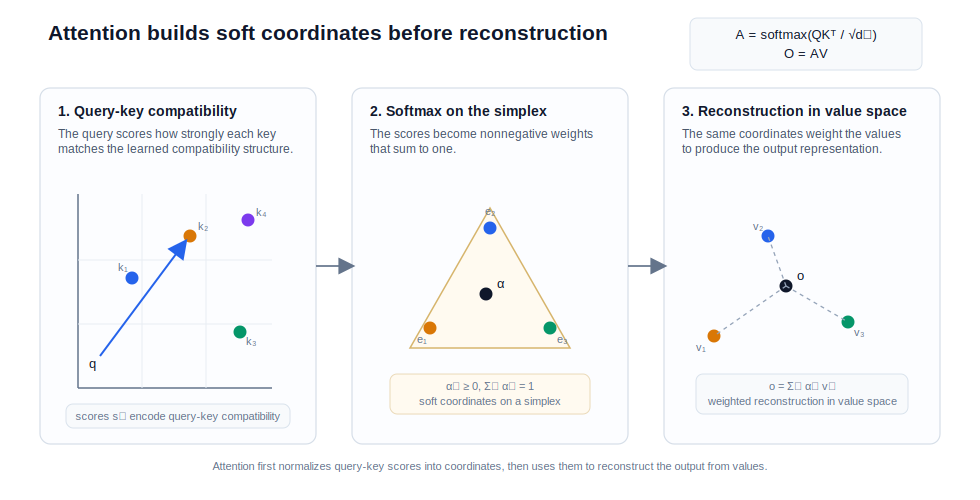

# Transformer Attention 的几何本质

<BlogPostLocaleSwitch current-locale="zh" zh-path="/blog/geometry-of-transformers/what-attention-does" en-path="/blog/geometry-of-transformers/what-attention-does-en" />

attention 常被描述成一串熟悉的工程步骤：计算 `Q`、`K`、`V`，做一次 `softmax`，然后对 `V` 加权求和。这个描述在实现层面完全正确，但如果停在这里，就很难解释它为什么能承担上下文检索、关系路由与表示重写等多种职责。真正关键的不是“加权平均”这个形式，而是这些权重是如何被生成出来的，以及它们把输出限制在什么样的几何对象上 [1-7]。

更精确的说法是：attention 通过 query-key 匹配定义一组上下文相关的软坐标，再在 value 空间中完成一次内容自适应重建。它因此更接近动态核回归、重心重建或内容相关投影，而不是简单复制某个 token 的表示。

> 核心结论：在标准 self-attention 中，query 决定当前表示应按何种关系读取上下文，key 决定哪些位置在这种关系下可被激活，softmax 则把匹配分数映射为概率单纯形上的软坐标；最终输出是这些坐标在 value 空间中的重心重建，而不是某个位置内容的直接拷贝 [1-7]。

在“Transformer 的几何结构”系列中，本文先定义单头 attention 的软坐标几何；下一篇 [Multi-Head Attention 的必要性与表达优势](/blog/geometry-of-transformers/why-multi-head-matters) 再说明为什么一套坐标系不足以覆盖语言里的异质关系。

## 1. 从矩阵公式看 attention 的结构

标准 scaled dot-product attention 写成矩阵形式为

$$
\operatorname{Attn}(Q,K,V)
=
\operatorname{softmax}\!\left(\frac{QK^\top}{\sqrt{d_k}}\right)V.
$$

记

$$
A = \operatorname{softmax}\!\left(\frac{QK^\top}{\sqrt{d_k}}\right),
$$

则输出可写为

$$
O = AV.
$$

这里的 $A \in \mathbb{R}^{n \times n}$ 是一个行随机矩阵：每一行非负，且和为 $1$。对第 $i$ 个位置而言，

$$
o_i = \sum_{j=1}^n \alpha_{ij} v_j,
\qquad
\alpha_i \in \Delta^{n-1},
$$

其中 $\Delta^{n-1}$ 是概率单纯形。这个表达已经揭示了 attention 的几何含义：每个 query 位置先在全部上下文位置上生成一组软坐标 $\alpha_i$，再用这组坐标对 value 做重心组合。

因此，attention 的输出并不是任意向量，而总落在当前 value 集合的凸包中。这是它与“自由线性层”之间的第一个根本区别。

## 2. Query-Key 内积到底在测什么？

对位置 $i,j$，attention logit 为

$$
s_{ij} = \frac{q_i^\top k_j}{\sqrt{d_k}}
= \frac{x_i^\top W_Q^\top W_K x_j}{\sqrt{d_k}}.
$$

这个式子说明，attention 并不是在原始表示空间中直接比较“两个 token 是否相似”，而是在一个由 $W_Q^\top W_K$ 定义的可学习双线性形式下衡量它们是否匹配。于是：

- query 不是内容本身，而是当前读取任务的探针；
- key 不是内容本身，而是当前位置在某种关系下是否可被读取的索引；
- 匹配标准不是固定距离，而是由参数与层级共同决定的动态几何。

因此，attention 的第一步不应被表述为“找最像我的 token”，而应表述为：**在当前 head 所定义的关系度量下，哪些上下文位置最值得被当前 query 读取。**

这也是同一 token 在不同层、不同 head 中会参与完全不同匹配模式的原因。attention 所学习的不是一个统一的相似度，而是一族上下文相关的关系度量 [1][5]。

## 3. 为什么要除以 $\sqrt{d_k}$？

scaled dot-product attention 里的缩放项常被当成实现细节一笔带过，但它实际上承担了重要的数值角色。若 $q_i$ 与 $k_j$ 的各维大致零均值、方差相近，那么未缩放的内积

$$
q_i^\top k_j = \sum_{\ell=1}^{d_k} q_{i\ell} k_{j\ell}
$$

其方差通常会随 $d_k$ 线性增长。于是，当 head 维度变大时，logits 的典型幅度会变成 $O(\sqrt{d_k})$，softmax 很快就会进入近似饱和区：少数位置权重接近 `1`，其余位置权重接近 `0`，梯度也随之变得尖锐而不稳定 [1]。

把内积除以 $\sqrt{d_k}$ 的作用，就是把 logits 的方差重新拉回 $O(1)$ 量级，使 softmax 在不同 head 宽度下都维持可训练的数值范围。这个缩放项因此不是装饰性的常数，而是让“可学习双线性匹配”变成“可优化概率坐标”的必要条件。

## 4. softmax 为什么对应“软坐标”而不是“硬检索”？

一旦得到 logits $s_{ij}$，softmax 会把它们转化为满足

$$
\alpha_{ij} \ge 0, \qquad \sum_j \alpha_{ij} = 1
$$

的权重。几何上，这等价于把第 $i$ 个 query 对上下文的读取方式限制在概率单纯形上。于是输出

$$
o_i = \sum_j \alpha_{ij} v_j
$$

是当前 value 向量的重心重建。

这一步之所以重要，是因为它区分了 attention 与两类常见误解。

- 它不是硬检索：模型不必从一个位置中拿回全部信息，而是可以从多个位置平滑汇聚内容。
- 它也不是正交投影：softmax 引入非线性归一化，且 key 空间与 value 空间并不必须一致。

因此，更精确的比喻是“软投影”或“内容相关核回归”，而不是普通线性代数意义上的投影算子。图 1 可以把这一步拆成可视化的两层过程。

*图 1. query-key 匹配先生成概率单纯形上的软坐标，attention 输出则是这些坐标在 value 空间中的重心重建。*

图 1 最重要的地方，是它把“加权平均”分解成了“先定坐标，再做重建”。如果漏掉前一步，就会把 attention 误读成普通平滑器，而看不到它真正的关系选择作用。

## 5. 为什么 attention 比固定卷积或固定窗口更灵活？

从几何角度看，self-attention 之所以强，不在于它“看得远”，而在于它能把读取规则也做成输入相关的。与固定卷积或固定窗口相比，它至少有三点结构优势。

### 全局可达

每个 query 默认都能访问整段上下文，因此长距离依赖不必沿着时间步逐层传递 [1]。

### 内容自适应

卷积核在不同位置共享相同的读取规则，而 attention 的权重随 query-key 匹配实时变化，因此“看哪里”取决于当前内容。

### 可退化为更简单算子

在适当参数化下，多头 self-attention 可以表达卷积结构 [7]。这说明 attention 不是卷积的弱替代，而是更一般的动态关系算子。

因此，attention 的核心优势并不是“全局平均”，而是“全局范围内的内容相关读取”。

## 6. 为什么 attention 权重不能被直接等同于解释？

一旦把 attention 看成软坐标系统，很容易进一步误以为这些坐标本身就是模型的可解释因果说明。这个推断并不成立。Brunner 等人的工作表明，在某些条件下，attention 权重本身并不具有良好的可识别性：不同参数化可能产生相同输出，却对应不同的注意力分布 [5]。

因此，attention 权重确实反映了模型的一条读取路径，但它并不是唯一、也未必是充分的人类可解释说明。更何况 attention 也不是 Transformer 的全部。Geva 等人指出，FFN 在很大程度上可以被理解为位置上的 key-value memory，负责在当前位置执行更强的内容选择与写入 [6]。

于是，一个完整层的表示更新更接近于：

1. attention 先完成上下文路由与混合；
2. 残差连接保留原始表示；
3. FFN 再在当前位置做更强的非线性变换与模式提取。

也就是说，attention 提供的是上下文读取机制，而不是完整语义推理闭环。

## 7. attention 有多强，又有什么边界？

从正面看，带位置编码的 Transformer 在函数逼近上具有很强的表达能力 [3]。这说明 attention 远不是“只能做加权平均”的弱算子，而是更大表示系统里的关键上下文映射模块。

从反面看，纯 self-attention 也有理论边界。Hahn 指出，如果层数或头数不随输入长度增长，纯 self-attention 在某些形式语言和层级结构上存在限制 [4]。这提醒我们，attention 的能力依赖于层数、位置编码、非线性模块与多头结构，而不是来自单个注意力矩阵本身。

因此，最准确的说法不是“attention 单独完成理解”，而是：**attention 为 Transformer 提供了内容相关的上下文坐标系统，使后续层能够在全局依赖之上继续计算。**

## 8. 结语

attention 的本质，不应被压缩成“对 value 做加权平均”。更准确的表述是：它先通过 query-key 几何生成一组输入相关的软坐标，再用这些坐标在 value 空间中完成重心重建。这样一来，Transformer 的关键就不只是“看到了哪些 token”，而是“为当前 token 建立了怎样一套读取上下文的局部坐标系”。

归结起来，**attention 是一种内容相关的几何读取算子。** 它先生成坐标，再完成重建；而 multi-head 的问题，则是在同一层里并行提供多少套彼此不同的坐标系统。下一篇文章就讨论这一步。

继续阅读：[Multi-Head Attention 的必要性与表达优势](/blog/geometry-of-transformers/why-multi-head-matters)。

## 参考文献

[1] VASWANI A, SHAZEER N, PARMAR N, et al. Attention Is All You Need[C]// *Advances in Neural Information Processing Systems 30*. Red Hook, NY: Curran Associates, 2017. URL: [https://papers.nips.cc/paper/7181-attention-is-all-you-need](https://papers.nips.cc/paper/7181-attention-is-all-you-need).

[2] LEE J, LEE Y, KIM J, et al. Set Transformer: A Framework for Attention-based Permutation-Invariant Neural Networks[C]// *Proceedings of the 36th International Conference on Machine Learning*. PMLR, 2019: 3744-3753. URL: [https://proceedings.mlr.press/v97/lee19d.html](https://proceedings.mlr.press/v97/lee19d.html).

[3] YUN C, BHOJANAPALLI S, RAWAT A S, et al. Are Transformers Universal Approximators of Sequence-to-Sequence Functions?[C]// *International Conference on Learning Representations*. 2020. URL: [https://openreview.net/forum?id=ByxRM0Ntvr](https://openreview.net/forum?id=ByxRM0Ntvr).

[4] HAHN M. Theoretical Limitations of Self-Attention in Neural Sequence Models[J]. *Transactions of the Association for Computational Linguistics*, 2020, 8: 156-171. DOI: [10.1162/tacl_a_00306](https://doi.org/10.1162/tacl_a_00306).

[5] BRUNNER G, LIU Y, PASCUAL D, et al. On Identifiability in Transformers[C]// *International Conference on Learning Representations*. 2020. URL: [https://research.google/pubs/on-identifiability-in-transformers/](https://research.google/pubs/on-identifiability-in-transformers/).

[6] GEVA M, SCHUSTER R, BERANT J, et al. Transformer Feed-Forward Layers Are Key-Value Memories[C]// *Proceedings of the 2021 Conference on Empirical Methods in Natural Language Processing*. Online and Punta Cana, Dominican Republic: Association for Computational Linguistics, 2021: 5484-5495. DOI: [10.18653/v1/2021.emnlp-main.446](https://doi.org/10.18653/v1/2021.emnlp-main.446).

[7] CORDONNIER J-B, LOUKAS A, JAGGI M. On the Relationship between Self-Attention and Convolutional Layers[C]// *International Conference on Learning Representations*. 2020. URL: [https://openreview.net/forum?id=zoPf7R-2wZr](https://openreview.net/forum?id=zoPf7R-2wZr).
