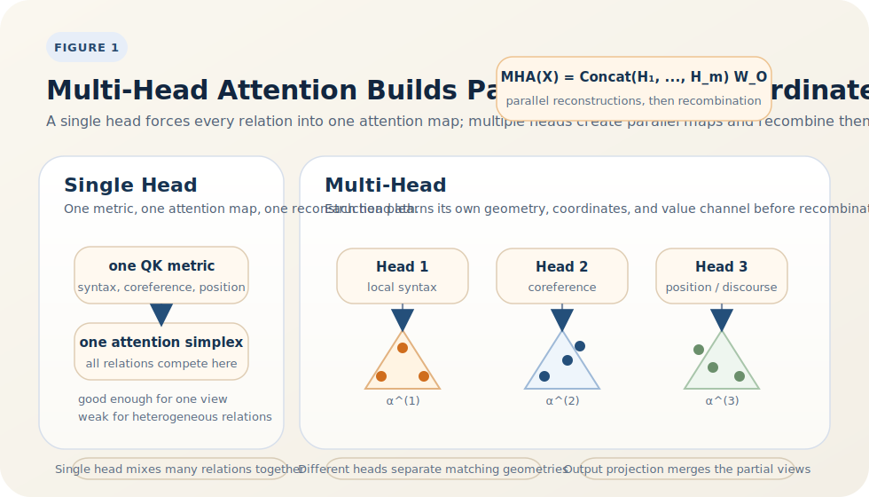

# Multi-Head Attention 的必要性与表达优势

<BlogPostLocaleSwitch current-locale="zh" zh-path="/blog/geometry-of-transformers/why-multi-head-matters" en-path="/blog/geometry-of-transformers/why-multi-head-matters-en" />

如果单个 attention head 已经能通过 query-key 匹配生成软坐标，并在 value 空间完成重建，那么一个自然问题就是：为什么还需要 multi-head？为什么不能只保留一个更宽的 head，让同一套注意力机制处理全部关系？这个问题不能靠“经验上更好”来回答，必须回到算子的几何结构本身 [1-6]。

单头 attention 的真正限制，不是参数太少，而是它只能为每个位置提供一套匹配几何、一组软坐标和一条内容通道。自然语言中的依赖关系显然并不单一：位置偏移、句法依赖、共指链、篇章回溯以及任务相关提示往往需要不同的读取规则。multi-head 的作用，正是在同一层内并行提供多套不同的上下文坐标系统。

> 核心观点：每个 attention head 都定义了一套独立的 query-key 度量、softmax 坐标与 value 映射，因此 multi-head attention 的本质不是重复同一运算，而是并行构造多张不同的上下文几何图；它提升的不是单纯参数量，而是关系解耦、内容解耦与并行计算能力 [1-6]。

## 1. 从公式看，多头究竟多了什么？

标准 multi-head attention 可写为

$$
\operatorname{MHA}(X)
=
\operatorname{Concat}(H_1,\dots,H_m)W_O,
$$

其中第 $h$ 个 head 为

$$
H_h = A_h V_h,
\qquad
A_h = \operatorname{softmax}\!\left(\frac{Q_h K_h^\top}{\sqrt{d_h}}\right),
$$

并且

$$
Q_h = XW_Q^{(h)}, \qquad
K_h = XW_K^{(h)}, \qquad
V_h = XW_V^{(h)}.
$$

这组公式最关键的地方在于：每个 head 都拥有自己独立的

- 匹配度量 $W_Q^{(h)\top}W_K^{(h)}$；
- 注意力分布 $A_h$；
- 内容映射 $W_V^{(h)}$；
- 输出重建 $H_h$。

因此，多头并不是把同一张注意力图复制多次，而是在并行学习多种“谁该被读取、被读出后应返回哪类信息”的规则。

## 2. 为什么“一个更宽的单头”并不等价于多头？

很多人会自然地问：如果总维度不变，把多个 head 拼成一个更宽的单头，难道不能得到同样表达力吗？关键差别在于，单头无论多宽，都只会产生**一张**注意力矩阵；而多头会产生多张彼此独立的注意力矩阵。

更形式化地说，若把总通道宽度固定为 $m d_h$，一个宽单头仍然只能为位置 $i$ 生成一组权重

$$
\alpha_i \in \Delta^{n-1},
$$

于是所有被读出的特征都必须沿同一组坐标混合。相比之下，多头会生成

$$
\alpha_i^{(1)},\dots,\alpha_i^{(m)},
$$

使同一位置可以因为不同子任务而同时关注不同上下文。一个 head 可以看局部句法，另一个可以看长程共指，第三个则可以读取位置模式；这些读取不会被迫竞争同一张概率图。

更重要的是，这种差异不能被简单的线性重参数化消除。原因在于 softmax 是逐 head 单独作用的非线性归一化。把所有特征先拼起来再做一次 softmax，通常不能复现“先分别归一化、再拼接”的结果。也正因为如此，多头并不只是把通道切碎，而是在结构上引入了多套彼此独立的选择机制。

## 3. 单头 attention 的瓶颈在哪里？

对固定 query 位置 $i$，单头 attention 只能生成一组软坐标

$$
\alpha_i \in \Delta^{n-1},
$$

并在一套 value 表示上完成一次重建。这会带来三个结构性限制。

### 匹配几何单一

单头只能通过一套双线性形式定义“相关性”。但语言中的相关性并不唯一；同一位置可能同时需要依据句法关系、指代关系、位置关系或主题关系读取上下文。

### 坐标系统单一

单头只能给出一张注意力分布图。若当前 token 既需要定位主语，又需要回溯代词先行词，还需要提取局部修饰语，这些需求就必须在同一组概率坐标里竞争。

### 内容通道单一

即便匹配到了正确位置，单头也只能通过一套 $W_V$ 读取内容。于是“因为句法原因关注某位置”和“因为语义原因关注某位置”仍可能被强行揉进同一条内容路径里。

因此，单头的根本局限不是“表示不出任何关系”，而是：**它把过多异质关系压进了同一套几何读取机制。**

## 4. 为什么多头可以被理解为多套上下文坐标系？

引入多头后，同一位置 $i$ 会在每个 head 上得到一组独立的软坐标

$$
\alpha_i^{(h)} \in \Delta^{n-1}.
$$

这意味着模型不再只有一种“看上下文”的方式，而是同时拥有多张局部坐标图。每个 head 都在回答一组稍有不同的问题：

- 在这个视角下，哪些位置最相关？
- 相关性应按照什么关系定义？
- 一旦读取这些位置，应该抽取什么类型的内容？

为了把“一个宽单头”和“多个独立头”的差别说清楚，图 1 最直观。

*图 1. 单头只能在一套匹配几何中生成一组软坐标；多头则会并行生成多组坐标，并通过不同的 value 通道完成多个重建，再统一映射回输出空间。*

图 1 说明，多头增加的不只是通道数，而是独立归一化后的选择机制数量。因此，把 multi-head attention 解释为“多套上下文坐标系”并不是修辞，而是由公式直接支持的几何陈述：每个 head 的确都定义了不同的匹配规则、不同的单纯形坐标和不同的内容读出路径。

## 5. 这种并行坐标化为什么会提升表达力？

多头机制带来的提升，至少来自三个层面。

### 关系解耦

不同 head 可以分别学习不同关系类型。Clark 等人与 Voita 等人的分析表明，某些 head 会稳定地关注分隔符、相对位置、句法依赖或共指模式 [2][3]。这说明模型确实会利用多头把不同关系分散到不同通道。

### 内容解耦

即使多个 head 关注同一位置，由于 $W_V^{(h)}$ 不同，它们也可以从同一 token 中读出不同方面的内容。一个 head 可能更偏向结构信号，另一个则偏向语义属性或任务相关提示。

### 并行组合

Weiss 等人的 RASP 视角说明，Transformer 的许多序列计算可以分解成并行的 selection 与 aggregation 步骤，而 head 数会直接影响这些步骤能否在较浅层数内同时实现 [6]。因此，多头不仅让关系更可分，也让并行计算更容易。

从这个角度看，multi-head 提升的不是一条更宽的读取路径，而是一组可并行组合的读取路径。

## 6. 实证上，head 会真的分工吗？

现有分析给出的答案是：会，但分工并不平均。Voita 等人发现，一部分 head 会承担稳定而重要的语言学功能，而许多其余 head 可以被较大幅度剪枝，性能只轻微下降 [3]。Michel 等人也得出类似结论：不少 head 的确冗余，但某些层和某些 head 明显更关键 [4]。

这说明 multi-head 的价值不能被误读成“每个 head 都不可替代”。更准确的判断是：

- 模型需要足够多的 head 来提供关系分散与优化自由度；
- 训练过程会让其中一部分 head 形成稳定功能；
- 其余 head 可以表现为备份通道、辅助通道或训练过程中的冗余空间。

因此，冗余并不否定多头机制，反而说明它为优化提供了更宽松的解耦空间。

## 7. 为什么 head 数量也不是越多越好？

若总宽度固定，head 数增加就意味着单个 head 维度 $d_h$ 下降。于是会出现明确权衡：

- 头太少，异质关系难以分开，不同读取需求会挤在同一几何中；
- 头太多，单个通道过窄，容易出现表达不足或冗余堆积。

这也解释了为什么“有些 head 可以剪掉”并不推出“单头就够了”。正确结论应当是：多头是必要的结构，但有效头数取决于模型宽度、层数、任务与训练动态 [4][5]。

换句话说，问题不在于是否需要多个 head，而在于系统最需要多少套并行坐标系。

## 8. 结语

multi-head attention 的关键价值，不是把同一注意力运算重复多次，而是在同一层中并行提供多套不同的上下文几何。单头已经能完成“软坐标 + 重建”，多头则把这种机制复制到多个互不相同的关系视角中，再通过输出映射统一整合。

归根结底，**multi-head 的本质是并行坐标化。** Transformer 之所以能在同一层里同时处理位置模式、句法依赖、共指关系与任务提示，不是因为单一巨大注意力矩阵足够万能，而是因为模型拥有多套可以协同工作、也可以彼此分工的上下文坐标系。

## 参考文献

[1] VASWANI A, SHAZEER N, PARMAR N, et al. Attention Is All You Need[C]// *Advances in Neural Information Processing Systems 30*. Red Hook, NY: Curran Associates, 2017. URL: [https://papers.nips.cc/paper/7181-attention-is-all-you-need](https://papers.nips.cc/paper/7181-attention-is-all-you-need).

[2] CLARK K, KHANDELWAL U, LEVY O, et al. What Does BERT Look At? An Analysis of BERT's Attention[C]// *Proceedings of the 2019 ACL Workshop BlackboxNLP: Analyzing and Interpreting Neural Networks for NLP*. Florence, Italy: Association for Computational Linguistics, 2019: 276-286. DOI: [10.18653/v1/W19-4828](https://doi.org/10.18653/v1/W19-4828).

[3] VOITA E, TALBOT D, MOISEEV F, et al. Analyzing Multi-Head Self-Attention: Specialized Heads Do the Heavy Lifting, the Rest Can Be Pruned[C]// *Proceedings of the 57th Annual Meeting of the Association for Computational Linguistics*. Florence, Italy: Association for Computational Linguistics, 2019: 5797-5808. DOI: [10.18653/v1/P19-1580](https://doi.org/10.18653/v1/P19-1580).

[4] MICHEL P, LEVY O, NEUBIG G. Are Sixteen Heads Really Better than One?[C]// *Advances in Neural Information Processing Systems 32*. Red Hook, NY: Curran Associates, 2019. URL: [https://papers.nips.cc/paper/9551-are-sixteen-heads-really-better-than-one](https://papers.nips.cc/paper/9551-are-sixteen-heads-really-better-than-one).

[5] CORDONNIER J-B, LOUKAS A, JAGGI M. On the Relationship between Self-Attention and Convolutional Layers[C]// *International Conference on Learning Representations*. 2020. URL: [https://openreview.net/forum?id=zoPf7R-2wZr](https://openreview.net/forum?id=zoPf7R-2wZr).

[6] WEISS G, GOLDBERG Y, YAHAV E. Thinking Like Transformers[C]// *Proceedings of the 38th International Conference on Machine Learning*. PMLR, 2021: 11080-11090. URL: [https://proceedings.mlr.press/v139/weiss21a.html](https://proceedings.mlr.press/v139/weiss21a.html).
