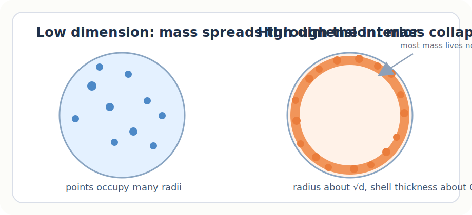
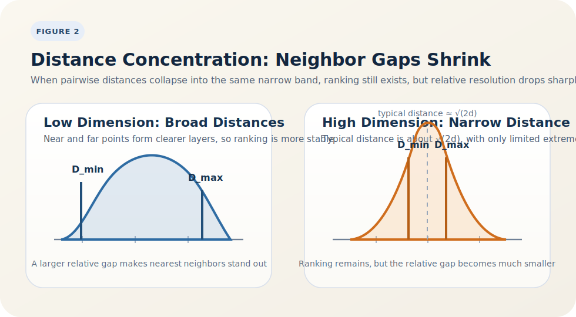

# 高维空间中的距离集中与度量失效

在很多初学机器学习的直觉里，**距离**几乎是一个天然可靠的量。两个点离得近，似乎就意味着它们更相似；两个点离得远，似乎就意味着它们更不同。这个判断在二维、三维空间里通常没有太大问题。我们看地图、看散点图、看图像中的局部结构，都会本能地把“近”理解成“相似”。

但一旦维度升高，这个直觉就会迅速失灵。高维几何里最经典的结论之一是：

> 在高维空间中，最近邻和最远邻之间的相对差别会越来越小。

也就是说，对于一个查询点来说，其他样本并不是分散在“明显近”“中等远”“明显远”的多个层次上，而是大量堆积在一个相当狭窄的距离区间里。距离本身当然没有消失，但它作为“区分相似与不相似”的信号，开始变得越来越弱。

这篇文章想回答的就是这个问题：

> **高维空间中的距离集中与度量失效**

更准确地说，为什么维度一高，欧氏距离就不再像低维时那样提供稳定、可解释、可区分的相似性结构？

## 1. 直觉问题：为什么最近邻会越来越像最远邻？

先从一个简单的思想实验开始。

假设我们在单位超立方体中均匀采样大量点，然后随机取一个查询点，计算它到其他样本的欧氏距离。在二维平面里，我们通常很容易找到一个“明显更近”的邻居，也能找到一些“明显更远”的点。最近邻和最远邻之间往往存在一个清楚的间隔。

但在高维空间中，这种间隔会迅速缩小。原因并不是因为所有点真的挤到了同一个位置，而是因为**绝大多数点的距离都集中在一个很窄的区间里**。于是最近邻虽然仍然存在，但它只是“略微更近一点”；最远邻也只是“略微更远一点”。从相对比例上看，这两者越来越像。

很多文献会用下面这个量来描述距离区分度的退化。记查询点到样本集中最近点和最远点的距离分别为 $D_{\min}$ 与 $D_{\max}$，那么在典型高维模型下，随着维度 $d$ 增加，

$$
\frac{D_{\max} - D_{\min}}{D_{\min}} \to 0.
$$

这并不是一个流行化转述，而是高维近邻搜索文献中的经典主题；最常被引用的代表性工作见文献 [1], [2]。

这条式子不是说所有距离都完全相等，而是说：**距离的相对分辨率正在消失**。对很多算法来说，这才是关键。一个算法并不关心距离到底是 3.2 还是 3.8；它真正关心的是：

> **近的和远的，能不能被稳定地区分开。**

一旦这种分离能力衰减，很多依赖距离结构的算法就会失去可靠的判断依据。“最近邻”在数学上仍然存在，但在算法意义上未必还足够特殊。

*图 1. 低维时，点可以分布在从中心到边界的各个半径上；高维时，大部分概率质量会集中在半径约为 $\sqrt{d}$ 的薄壳附近。*

## 2. 第一把钥匙：薄壳现象

理解这个问题的第一把钥匙，是**高维随机向量的范数集中**。

考虑一个随机向量

$$
x = (x_1, x_2, \dots, x_d), \qquad x_i \overset{\text{i.i.d.}}{\sim} \mathcal{N}(0,1).
$$

它的平方范数满足

$$
\|x\|^2 = \sum_{i=1}^d x_i^2 \sim \chi_d^2.
$$

因此

$$
\mathbb{E}\|x\|^2 = d, \qquad \mathrm{Var}(\|x\|^2) = 2d.
$$

这已经告诉我们，向量长度的典型尺度是 $\sqrt{d}$。但真正重要的不是“长度随着维度变大”，而是**长度的波动并没有按同样的速度变大**。

更精确地说，$\|x\|$ 作为高斯向量的范数，是一个 1-Lipschitz 函数，因此满足典型的高斯集中不等式：

$$
\mathbb{P}\!\left(\left|\|x\| - \mathbb{E}\|x\|\right| \ge t\right)
\le 2 e^{-t^2/2}.
$$

这里我写的是标准高斯模型下最常见的一种形式；把“范数集中”“Lipschitz 函数集中”和更一般的测度集中现象统一起来的标准参考可见文献 [3], [4], [5]。

这意味着 $\|x\|$ 偏离其均值的典型幅度是 $O(1)$，而它的均值本身却是 $\Theta(\sqrt{d})$。换句话说，

$$
\|x\| = \sqrt{d} + O_P(1),
$$

其中 $O_P(1)$ 表示：在概率意义下，这个波动保持在常数量级，并不会随着 $d$ 一起发散。

于是相对波动量级是

$$
\frac{\|x\| - \sqrt{d}}{\sqrt{d}} = O_P\!\left(\frac{1}{\sqrt{d}}\right).
$$

这就是著名的 **thin shell phenomenon（薄壳现象）**：

> 在高维空间中，随机点几乎都落在某个半径附近的一层很薄的球壳上。

这里“薄”说的是**相对半径而言很薄**。半径大约是 $\sqrt{d}$，而壳层厚度只在常数量级附近，所以相对厚度会像 $1/\sqrt{d}$ 一样衰减。

这和低维直觉非常不同。在二维、三维里，我们会自然地认为“球体的大部分体积都在内部”；但在高维里，几乎所有概率质量都被挤压到接近边界的一层壳上。于是点云不再像低维时那样“有的在里、有的在中间、有的在外”，而更像是一大群点同时贴在同一层高维球壳上。

这就是距离退化的第一个几何原因：如果大多数点的范数都差不多，那么两点之间可用来区分远近的自由度，本身就已经减少了一大块。

## 3. 第二把钥匙：距离集中

现在考虑两个独立随机向量

$$
x, y \overset{\text{i.i.d.}}{\sim} \mathcal{N}(0, I_d).
$$

那么它们的差向量满足

$$
x-y \sim \mathcal{N}(0, 2I_d),
$$

从而

$$
\|x-y\|^2 \sim 2\chi_d^2.
$$

于是

$$
\mathbb{E}\|x-y\|^2 = 2d, \qquad
\mathrm{Var}(\|x-y\|^2) = 8d.
$$

如果我们看的是**平方距离**，它的均值是 $2d$，标准差是 $\sqrt{8d}$，因此其相对波动大小为

$$
\frac{\sqrt{\mathrm{Var}(\|x-y\|^2)}}{\mathbb{E}\|x-y\|^2}
= \frac{\sqrt{8d}}{2d}
= \Theta\!\left(\frac{1}{\sqrt{d}}\right).
$$

如果看实际距离而不是平方距离，结论依然成立：$\|x-y\|$ 会集中在 $\sqrt{2d}$ 附近，而且相对于其典型尺度的波动会继续缩小。一个常见的写法是

$$
\|x-y\| = \sqrt{2d} + O_P(1),
$$

也就是说，距离的绝对波动仍然只是常数量级，而它的均值已经增长到 $\Theta(\sqrt{d})$。因此距离的相对波动满足

$$
\frac{\|x-y\| - \sqrt{2d}}{\sqrt{2d}}
= O_P\!\left(\frac{1}{\sqrt{d}}\right).
$$

这就是所谓的 **distance concentration（距离集中）**。

从概率论角度看，这并不神秘。距离是许多坐标贡献的总和。维度一高，每一维各贡献一点，最后就会因为大数定律、集中不等式和卡方分布的稳定性而呈现出极强的规律性。结果就是：

> 几乎所有样本对之间的距离，都被压缩到同一个典型尺度附近。

从高维概率的角度看，这一步本质上是“范数集中”在差向量 $x-y$ 上的直接应用，因此仍然属于同一套集中理论框架；相关背景和工具的系统叙述见文献 [3], [4], [5]。

空间当然变大了，但“远近差异”并没有随着空间一起变得更丰富；恰恰相反，它变得更加平均，更加稳定，也因此更加缺乏判别力。

*图 2. 在低维时，距离分布更宽，最近邻与最远邻往往分离明显；在高维时，距离会挤进狭窄区间，极值之间的相对差距迅速缩小。*

## 4. 从距离集中到“最近邻像最远邻”

前面两节解释了为什么**单个距离**会集中，但我们还需要再迈一步，才能解释为什么最近邻和最远邻也会“长得越来越像”。

设查询点为 $q$，样本为 $x_1, \dots, x_n$，记

$$
D_i = \|q - x_i\|, \qquad
D_{\min} = \min_i D_i, \qquad
D_{\max} = \max_i D_i.
$$

如果每个 $D_i$ 都围绕某个典型尺度 $\mu_d \asymp \sqrt{d}$ 集中，且其绝对波动只有常数量级，那么极值之间的差异即便会随着样本数 $n$ 增大而略有放大，也通常只会放大到“若干个标准差”的水平。一个常用的启发式估计是：

$$
D_{\max} - D_{\min} = O_P(\sqrt{\log n}),
$$

而另一方面，

$$
D_{\min} = \Theta_P(\sqrt{d}).
$$

于是相对间隔满足

$$
\frac{D_{\max} - D_{\min}}{D_{\min}}
= O_P\!\left(\sqrt{\frac{\log n}{d}}\right).
$$

这条估计非常有信息量。它表明，只要样本规模 $n$ 不是以 $e^{cd}$ 这种指数速度爆炸增长，那么随着维度增大，最近邻和最远邻之间的**相对差别**仍然会走向 0。

这里的写法是对经典结论的一种启发式总结：严格的“最近邻变得不再有意义”讨论可以追溯到文献 [1]，而对不同距离度量在高维中表现差异的系统分析见文献 [2]。

这就是为什么“距离失效”并不是一个模糊的经验说法，而是高维集中现象的自然后果：

1. 样本先集中在同一个半径附近的薄壳上。
2. 任意两点之间的距离再集中到同一个典型尺度附近。
3. 即便取最小值和最大值，它们也只是这个典型尺度周围的轻微扰动。

于是“最近邻”和“最远邻”仍然存在，但它们越来越像是同一批几乎等距样本中的两个排序端点，而不再对应两个本质不同的几何层次。

## 5. 机器学习里会发生什么？

距离失效并不是一个纯数学趣闻，它会直接影响很多机器学习方法。

### 5.1 kNN

kNN 的核心假设是：

> 离查询点更近的样本，在语义上应该也更相似。

但当高维距离集中以后，“更近”往往只意味着**数值上略微更小**，而不是**结构上明显更近**。这会导致邻居排序对噪声、尺度变换、无关维度乃至数值扰动都变得异常敏感。

于是同一个样本可能只因为距离差了 0.01，就从第 3 个邻居掉到第 15 个邻居。数学上的排序当然还在，但这种排序未必仍然具备稳定的语义含义。

### 5.2 聚类

很多聚类方法同样依赖距离结构。例如 k-means 的基本假设就是：

> 簇内点更近，簇间点更远。

但如果整体距离都高度集中，那么簇内与簇间的分离度就会被显著削弱。算法可能更多是在利用采样波动或噪声方向，而不是在利用真正稳定的几何结构。

这也是为什么高维数据在聚类前，往往需要先做标准化、降维，或者先学习一个更合适的表示空间。

### 5.3 相似性搜索与向量检索

在向量数据库和信息检索里，我们也经常做 nearest neighbor search。但这里的关键并不是“高维距离天然有效”，而是：

> embedding 空间已经被训练成了一个语义空间。

如果直接在原始高维特征上做近邻搜索，效果往往很脆弱；但如果先通过模型学习表示，再在表示空间里做 cosine similarity 或 nearest neighbor 检索，效果通常会好很多。

关键差别不在搜索算法，而在于空间本身是否已经承载了任务相关的结构。

## 6. 一个容易被误解的点：距离失效，不等于几何方法没用

这里需要非常明确地区分两件事。

第一，高维里的“距离失效”并不是说**任何高维数据集**都不能用距离；第二，它也不是说**几何方法本身**失去了价值。真正更准确的说法是：

> 在缺乏结构假设、包含大量噪声维度、并直接使用原始坐标的情况下，欧氏距离的判别力会快速退化。

如果数据本身位于低维流形上，或者经过良好的标准化、归一化、度量学习、表示学习，那么距离仍然可能非常有效。问题从来不是“距离这个概念错误了”，而是：

> **原始空间未必是一个有意义的几何空间。**

这恰恰把我们带到了表示学习最核心的思想上。

## 7. 距离失效，其实是表示学习的起点

高维几何给机器学习的真正启示，并不是“距离不能用了”，而是：

> **原始空间里的距离，通常不能被直接当作语义相似性。**

这就是 representation learning 的核心动机之一。我们并不是在一个任意给定的坐标系里机械地计算距离，而是在**学习一个新的表示空间**，让几何关系重新变得有意义。

一个好的表示空间应该尽量满足：

- 语义相似的样本，在几何上彼此接近。
- 语义不同的样本，在几何上保持分离。

也就是说，空间不是一个中性的容器；空间结构本身就是模型需要学习的对象。原始空间里的距离失效，反而迫使我们去构造更好的空间，让“近”和“远”重新带回可解释的意义。

从这个角度看，高维几何并没有否定机器学习中的几何方法，反而给了它们一个更深刻的起点：

> 不是所有空间都值得相信，但一个被正确学习出来的空间，值得。

下一篇文章，我们会继续讨论另一个同样经典、也同样反直觉的现象：

> **高维向量近似正交的几何机制**

它看起来比“距离失效”更奇怪，但恰恰能进一步解释：为什么高维表示空间虽然会让距离集中，却仍然能够容纳大量稳定、可分的语义方向。

## 参考文献

1. Kevin S. Beyer, Jonathan Goldstein, Raghu Ramakrishnan, Uri Shaft. *When Is "Nearest Neighbor" Meaningful?* In *Database Theory - ICDT'99*, pp. 217-235, Springer, 1999. DOI: [10.1007/3-540-49257-7_15](https://doi.org/10.1007/3-540-49257-7_15). 可访问的技术报告版本： [University of Wisconsin-Madison TR1377](https://minds.wisconsin.edu/handle/1793/60174).
2. Charu C. Aggarwal, Alexander Hinneburg, Daniel A. Keim. *On the Surprising Behavior of Distance Metrics in High Dimensional Space*. In *Database Theory - ICDT 2001*, pp. 420-434, Springer, 2001. DOI: [10.1007/3-540-44503-X_27](https://doi.org/10.1007/3-540-44503-X_27).
3. Michel Ledoux. *The Concentration of Measure Phenomenon*. Mathematical Surveys and Monographs, Vol. 89, American Mathematical Society, 2001. 出版社页面： [AMS](https://bookstore.ams.org/view?ProductCode=SURV%2F89).
4. Roman Vershynin. *High-Dimensional Probability: An Introduction with Applications in Data Science*. Cambridge University Press, 2018. 与本文最相关的章节是 Chapter 3, *Random Vectors in High Dimensions*: [10.1017/9781108231596.006](https://doi.org/10.1017/9781108231596.006).
5. Stéphane Boucheron, Gábor Lugosi, Pascal Massart. *Concentration Inequalities: A Nonasymptotic Theory of Independence*. Oxford University Press, 2013. DOI: [10.1093/acprof:oso/9780199535255.001.0001](https://doi.org/10.1093/acprof:oso/9780199535255.001.0001).
