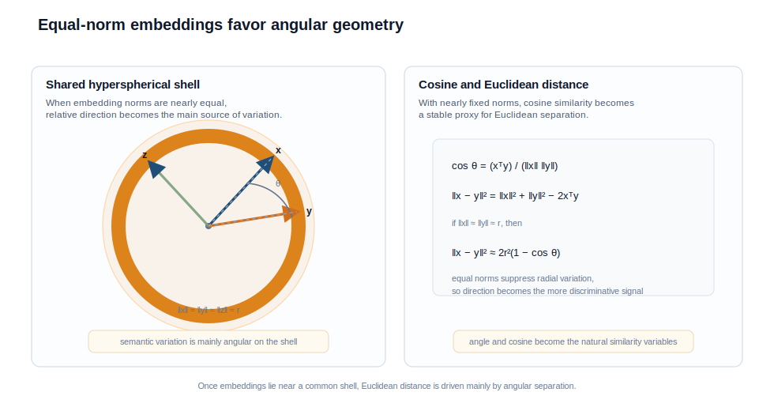

# Embedding 向量的超球面分布及其成因

<BlogPostLocaleSwitch current-locale="zh" zh-path="/blog/high-dimensional-space-and-machine-learning/hypersphere" en-path="/blog/high-dimensional-space-and-machine-learning/hypersphere-en" />

如果把现代 embedding 视为普通欧氏向量，就很难解释一个稳定经验事实：在许多检索、表征学习和分类系统中，向量往往并不均匀散落在整个空间内部，而是集中分布在某个高维球壳附近。更进一步，很多系统中最有效的相似度并不是未经归一化的欧氏距离，而是 cosine similarity [1-5]。

这两个现象并非彼此独立。高维概率会先压缩范数波动，并把可用自由度转移到方向结构上。训练过程随后又会进一步削弱径向噪声，把真正有判别力的差异更多地编码在角度中。于是，embedding 空间在实践中常常更接近一个超球面流形，而不是整个 $\mathbb{R}^d$。

> 核心观点：embedding 呈现近似超球面分布，通常是三种机制共同作用的结果：高维统计先导致范数集中，归一化与对比式训练目标进一步压缩径向自由度，而内积型读出又持续奖励方向可读的组织方式；因此，在大量任务中，角度比长度更稳定，也更接近表示真正承载的语义结构 [1-5]。

## 1. 球壳结构的第一来源：高维中的范数集中

对高维随机向量 $x \in \mathbb{R}^d$，若各维经过中心化且尺度相近，则

$$
\|x\|^2 = \sum_{i=1}^d x_i^2
$$

的期望通常随 $d$ 线性增长，而相对波动则随 $1/\sqrt{d}$ 收缩 [1]。在高斯或更一般的次高斯模型下，可以概括为

$$
\|x\| = \Theta(\sqrt{d}) \quad \text{with high probability}.
$$

这并不要求向量已经具备语义结构，它只是说明：高维本身就不鼓励样本在半径方向上拥有巨大的相对差异。换句话说，球壳是高维统计给出的默认舞台，而不是训练后才突然出现的异常形状。

这一步之所以重要，是因为它奠定了后续一切“方向主导”的前提。只有当大多数向量的范数已经落在相近区间内，角度信息才会开始压过长度信息。

## 2. 球壳结构的第二来源：训练目标主动削弱径向自由度

真实的 embedding 当然不是独立随机向量。训练过程会继续塑造其几何，并且在许多体系下，这种塑形恰好沿着“稳定长度、突出方向”的方向发展。

- 归一化层会主动控制特征尺度，抑制不同样本之间过大的范数漂移。
- 对比学习目标强调局部对齐与全局均匀展开，这天然偏向超球面上的角度组织 [2]。
- 一系列度量学习方法直接在单位超球面上优化判别边界，例如 NormFace、SphereFace 与 ArcFace 都把角度间隔当作核心变量 [3-5]。

因此，近似球壳结构并不是单一模块的副作用，而是高维统计、网络归一化与损失设计同时收敛到的结果。高维先告诉模型“半径差异不稳定”，训练目标再进一步告诉模型“如果要把自由度留给最可迁移的结构，最好把它们留给方向”。图 1 正好把这种径向收缩与角度主导的关系画了出来。

*图 1. 当样本范数被压缩到相近尺度后，向量之间的主要差异转而表现为角度差异；这就是球壳几何与 cosine similarity 发生联系的根本原因。*

图 1 所展示的不是“所有点都完全等长”，而是“主要变化不再来自半径”。这一区分很重要，因为它决定了什么时候 cosine 会比未经归一化的欧氏距离更贴近真实几何。

## 3. 为什么 cosine similarity 会成为更自然的度量？

对两个向量 $x,y$，有

$$
\cos \theta = \frac{x^\top y}{\|x\|\,\|y\|},
$$

同时

$$
\|x-y\|^2 = \|x\|^2 + \|y\|^2 - 2x^\top y.
$$

若 $\|x\|$ 与 $\|y\|$ 都稳定在同一半径 $r$ 附近，则可近似写成

$$
\|x-y\|^2 \approx 2r^2(1 - \cos \theta).
$$

这说明，在球壳几何已经成立时，欧氏距离与 cosine similarity 实际上都在读取同一套角度信息；差别在于，前者仍然混入残余的范数波动，而后者显式地把这部分因素除掉了。于是，cosine similarity 往往更稳定，也更接近模型训练后真实使用的判别变量 [2-5]。

从几何上说，使用 cosine similarity 等价于先把向量投影到单位球面，再比较它们在球面上的相对位置。对已经贴近球壳分布的 embedding 而言，这种度量不是经验巧合，而是与其内在组织形式相匹配。

## 4. “近似在球面上”不等于范数彻底无意义

这里必须加入一个边界条件。说 embedding 近似活在球面上，并不意味着范数一定完全无信息。真实系统中，向量长度有时仍会与频率、置信度、显著性或样本难度相关。某些任务甚至会显式利用范数来表达附加信号。

因此，准确表述应当是：在许多现代表示学习任务里，**方向比范数更稳定、更可迁移，也更接近任务共享的语义结构**。范数并未被禁止，但它通常不再承担主要判别职责。

这一区分很重要。若把“超球面分布”误解为“所有向量必须严格单位范数”，就会把一个非常有效的一阶模型僵化成错误的硬约束。

## 5. 什么时候 cosine 与欧氏距离不再近似等价？

前文把 cosine 与欧氏距离联系了起来，但二者只在“范数变化已经足够小”这一条件下才近似等价。把半径显式写出来会更清楚。若记

$$
r_x = \|x\|, \qquad r_y = \|y\|,
$$

则有

$$
\|x-y\|^2 = (r_x-r_y)^2 + 2r_xr_y(1-\cos\theta).
$$

这个分解说明，欧氏距离包含两部分信息：径向差异 $(r_x-r_y)^2$ 与角度差异 $2r_xr_y(1-\cos\theta)$。当 $r_x$ 与 $r_y$ 几乎恒定时，第一项可以忽略，欧氏距离与 cosine 才会基本读取同一结构；若范数本身携带系统性信号，例如频率、置信度、活跃度或样本难度，那么两种度量就会给出不同排序。

这也是实践中一个重要的判断点：如果任务明确只关心语义方向，cosine 往往更稳；如果范数本身也具有任务意义，那么简单丢弃长度信息反而可能损失信号。同理，若表示整体存在明显各向异性或偏置主方向，那么仅仅切换为 cosine 也未必足够，还可能需要中心化、白化或额外归一化来修正几何。

## 6. 一个统一视角：表示空间更像超球面流形而非完整欧氏体积

把前后逻辑串起来，可以得到一条完整链条：

- 高维概率先把样本压到薄壳上；
- 薄壳上的随机方向再趋向近似正交；
- 训练目标继续强化方向可读性，并减少径向噪声；
- 检索、对比和分类等读出操作又持续奖励这种球面结构。

因此，虽然 embedding 形式上仍然嵌在 $\mathbb{R}^d$ 中，一个更贴切的近似模型通常是：它被训练成了带有局部语义结构的高维超球面流形。模型并没有平均使用整个欧氏空间，而是把大部分有用自由度压缩在一个更规则、更低熵的几何对象上。

这也是为什么理解 embedding 不能只盯着某一维坐标值，而要关注范数分布、角度分布、局部邻域与球面上的整体展开方式。

## 7. 结语

embedding 接近超球面分布，并不是工程实现中的偶然现象，而是高维概率规律与现代训练目标共同产生的稳定结果。范数集中给出了球壳舞台，近似正交提供了方向容量，训练目标再把语义写入这些方向关系中。

更准确地说，**cosine similarity 之所以在 embedding 系统中反复奏效，不只是因为它方便，而是因为训练后的表示本来就越来越接近球面上的几何。** 这也为理解球面码、词表容量与大模型 embedding 的组织方式提供了直接前提。

## 参考文献

[1] VERSHYNIN R. *High-Dimensional Probability: An Introduction with Applications in Data Science*[M]. Cambridge: Cambridge University Press, 2018. DOI: [10.1017/9781108231596](https://doi.org/10.1017/9781108231596).

[2] WANG T, ISOLA P. Understanding Contrastive Representation Learning through Alignment and Uniformity on the Hypersphere[C]// *Proceedings of the 37th International Conference on Machine Learning*. PMLR, 2020: 9929-9939. URL: [https://proceedings.mlr.press/v119/wang20k.html](https://proceedings.mlr.press/v119/wang20k.html).

[3] WANG F, XIANG X, CHENG J, et al. NormFace: L2 Hypersphere Embedding for Face Verification[C]// *Proceedings of the 25th ACM International Conference on Multimedia*. New York: ACM, 2017: 1041-1049. DOI: [10.1145/3123266.3123359](https://doi.org/10.1145/3123266.3123359).

[4] LIU W, WEN Y, YU Z, et al. SphereFace: Deep Hypersphere Embedding for Face Recognition[C]// *Proceedings of the IEEE Conference on Computer Vision and Pattern Recognition*. 2017: 6738-6746. DOI: [10.1109/CVPR.2017.713](https://doi.org/10.1109/CVPR.2017.713).

[5] DENG J, GUO J, XUE N, et al. ArcFace: Additive Angular Margin Loss for Deep Face Recognition[C]// *Proceedings of the IEEE/CVF Conference on Computer Vision and Pattern Recognition*. 2019: 4690-4699. DOI: [10.1109/CVPR.2019.00482](https://doi.org/10.1109/CVPR.2019.00482).
