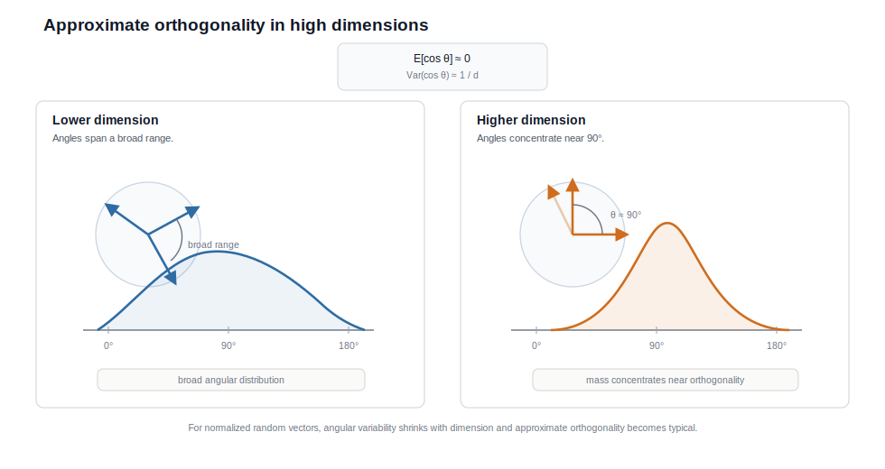

# 高维向量近似正交的几何机制

<BlogPostLocaleSwitch current-locale="zh" zh-path="/blog/high-dimensional-space-and-machine-learning/orthogonality" en-path="/blog/high-dimensional-space-and-machine-learning/orthogonality-en" />

在高维欧氏空间里，一个直接的问题是：如果半径差异不再可靠，那么高维空间里还有什么几何量值得保留？答案通常是角度。对归一化后的高维向量而言，内积会稳定收缩到零附近，而夹角则集中在 $90^\circ$ 左右 [1][2]。

这个结论并不意味着高维空间“没有结构”。相反，它意味着在范数已经集中之后，方向成为剩余自由度中最稳定、也最适合承载表示组织的部分。现代 embedding 空间的大量性质，正是建立在这一事实之上。

> 核心观点：对于高维球面上的随机方向，归一化内积的均值为零、方差按 $1/d$ 衰减，因此夹角会集中在直角附近；高维空间因而能够同时容纳大量彼此低相关的方向，这为 embedding 的可分性、球面码容量与对比学习中的全局展开提供了几何基础 [1-4]。

## 1. 从内积开始：为什么归一化后会趋向正交？

设 $x,y \in \mathbb{R}^d$ 是两个独立随机向量，坐标零均值、方差有限。我们关心的不是原始内积 $x^\top y$，而是归一化后的余弦相似度

$$
\cos \theta = \frac{x^\top y}{\|x\|\,\|y\|}.
$$

在标准化模型下，

$$
x^\top y = \sum_{i=1}^d x_i y_i
$$

是 $d$ 个独立乘积项之和，其波动量级为 $\sqrt{d}$；而分母 $\|x\|\,\|y\|$ 的典型量级为 $d$。于是得到

$$
\cos \theta = O_P\!\left(\frac{1}{\sqrt{d}}\right).
$$

如果进一步令

$$
u = \frac{x}{\|x\|}, \qquad v = \frac{y}{\|y\|},
$$

并把 $u,v$ 视为单位球面 $\mathbb{S}^{d-1}$ 上的随机点，则有更精确的结论 [1][2]

$$
\mathbb{E}\langle u,v\rangle = 0, \qquad
\mathrm{Var}(\langle u,v\rangle) = \frac{1}{d},
$$

而且在大维度下

$$
\sqrt{d}\,\langle u,v\rangle \Rightarrow \mathcal{N}(0,1).
$$

因此，随着维度上升，典型随机方向并不会彼此平行，而是越来越接近正交。

## 2. 为什么这是球面几何而不是巧合？

这一定律不是高斯模型的偶然产物，而是高维球面测度的普遍后果。把一个参考向量固定在北极方向之后，另一随机点相对它的纬度坐标会高度集中在赤道附近；换句话说，球面的大部分面积质量都位于与给定方向近似正交的区域 [2][3]。

因此，高维球面的关键特征并不是“半径变大”，而是“方向空间的测度重新分配”：

- 某个给定方向附近的尖帽区域只占极小面积；
- 与该方向近似正交的带状区域占据绝大多数测度；
- 随机采样到两个彼此接近平行的方向，反而是低概率事件。

把这两步放在一起看，高维样本先在径向上被压缩到薄壳，再在角度上被压缩到直角附近。前者削弱了长度差异，后者则把方向结构凸显出来。图 1 可以把这种“由长度转向方向”的变化可视化。

*图 1. 低维时，夹角分布较宽；高维时，归一化内积向零聚集，随机方向之间的夹角则收缩到直角附近。*

图 1 真正要强调的不是“直角很特殊”，而是分布宽度在迅速收窄。对表示学习而言，稳定性来自这种收窄，而不是来自某个精确的角度值。

## 3. 近似正交为什么意味着空间容量很大？

一旦大多数随机方向天然低相关，就可以在同一球面上放置大量“彼此不太冲突”的点。这正是高维方向容量的来源，也是球面码理论与表示学习发生联系的地方 [2][3]。

如果把一组单位向量 $u_1,\dots,u_N$ 的最大互相关定义为

$$
\mu = \max_{i \neq j} |\langle u_i,u_j\rangle|,
$$

那么“近似正交”并不要求 $\mu = 0$；它只要求 $\mu$ 足够小，使不同方向在内积读取时仍可区分。高维空间之所以能容纳远大于维度数目的对象，并不是因为每个对象都分到了一根独立坐标轴，而是因为球面允许大量小相关方向共存。

这对表示学习至少有三层意义。

- 它提供全局可分性。许多彼此弱相关的对象可以共享同一个表示空间而不立即塌缩。
- 它保留局部可塑性。局部相似对象仍可在一小片方向区域中形成簇，而不会破坏整个空间的低相关结构。
- 它支持线性读取。只要内积仍然可解释，注意力、相似度检索和线性分类器就都可以在该空间中稳定工作。

## 4. 为什么 embedding 尤其依赖这种方向容量？

现代模型的 embedding 表常常需要容纳数万甚至数十万个离散符号。如果继续采用低维直觉，会很容易误以为“维度小于对象数，因此必然拥挤”。高维几何并不支持这种判断。模型真正需要的不是“一词一维”，而是“许多对象在方向上保持足够可分”。

对 embedding 空间来说，这种容量并不只是一种被动福利，它还直接决定了训练目标能否顺利把统计关系写入空间：

- 无关或弱相关的词项需要尽量低相关，避免大规模相互干扰；
- 相关词项又需要允许局部聚集，以保留可迁移的语义近邻；
- 下游读出仍需要通过内积和线性映射完成，因此方向结构必须保持可计算性。

这也是为什么许多归一化表示方法会主动把向量拉回球面，并鼓励整体均匀展开：在一个高容量方向场里，局部对齐与全局分散可以同时被优化 [4]。

## 5. 近似正交并不等于“已经学出语义”

这里必须区分几何前提与语义结果。高维近似正交只说明空间装得下大量方向，并不说明这些方向已经对应任务相关结构。一个随机初始化的 embedding 矩阵同样可能彼此近似正交，但它并不因此具有语义价值。

真正赋予空间含义的是训练过程：

- 数据分布决定哪些对象应共享上下文统计；
- 损失函数决定哪些方向应被拉近、哪些应被推开；
- 模型参数化决定这些约束最终以何种几何形式稳定下来。

因此，更准确的说法是：高维近似正交为语义组织提供了容量与低干扰背景，但语义本身仍来自学习。

## 6. 为什么学习后的表示不会保持完全均匀？

还需要补上一条常被忽略的边界：高维随机方向趋向近似正交，并不意味着一个优秀表示空间应当保持“纯随机均匀”。如果训练后的 embedding 真的完全像随机点那样均匀铺满球面，那么语义相关对象就不会形成足够稳定的局部邻域，检索、聚类和分类也不会从中受益。

真正有用的表示几何，通常是对随机球面背景的有结构偏离：全局上仍保持较低相关，以避免大规模干扰；局部上又允许语义相关对象聚成簇，以形成可迁移的邻域结构。Wang 与 Isola 所说的 alignment 与 uniformity 的张力，正好刻画了这种平衡 [4]。如果只有 uniformity，没有 alignment，空间会变得“容量很大但任务无用”；如果只有 alignment，没有 uniformity，空间又会迅速塌缩。

因此，近似正交更适合被看作表示学习的几何底座，而不是训练完成后的最终形态。学习过程并不是在破坏高维几何，而是在这片高容量方向场上叠加局部结构、频率结构和任务结构。

## 7. 从近似正交到超球面表示

把这两步连起来，逻辑链条就很清楚了。高维中长度差异会被压缩，而归一化之后角度会集中到直角附近。于是，在高维表示空间里，长度常常不再是主要判别变量，方向才是。现代 embedding 系统再通过归一化层、对比学习和角度间隔损失进一步压缩径向自由度，最终把表示推向近似球面的组织方式。

这也解释了为什么后文会转向超球面的视角：在许多训练后的表示系统中，球面不是修辞，而是比原始欧氏空间更贴切的一阶近似模型。

## 8. 结语

高维空间真正稀缺的不是距离，而是可解释的几何量。一旦范数集中削弱了半径信息，方向就自然上升为主要变量。归一化内积向零收缩、夹角向直角集中，并不是几何结构变少，而是几何结构变得更规则。

更紧凑地说，**高维空间通过近似正交提供了巨大的方向容量，而现代表示学习正是把语义写进这片方向容量中。** 当训练进一步削弱径向自由度时，表示空间也就会顺势贴近超球面。

## 参考文献

[1] VERSHYNIN R. *High-Dimensional Probability: An Introduction with Applications in Data Science*[M]. Cambridge: Cambridge University Press, 2018. DOI: [10.1017/9781108231596](https://doi.org/10.1017/9781108231596).

[2] CAI T T, FAN J, JIANG T. Distributions of Angles in Random Packing on Spheres[J]. *Journal of Machine Learning Research*, 2013, 14(57): 1837-1864. URL: [https://jmlr.org/papers/v14/cai13a.html](https://jmlr.org/papers/v14/cai13a.html).

[3] CONWAY J H, SLOANE N J A. *Sphere Packings, Lattices and Groups*[M]. 3rd ed. New York: Springer, 1999. DOI: [10.1007/978-1-4757-6568-7](https://doi.org/10.1007/978-1-4757-6568-7).

[4] WANG T, ISOLA P. Understanding Contrastive Representation Learning through Alignment and Uniformity on the Hypersphere[C]// *Proceedings of the 37th International Conference on Machine Learning*. PMLR, 2020: 9929-9939. URL: [https://proceedings.mlr.press/v119/wang20k.html](https://proceedings.mlr.press/v119/wang20k.html).
