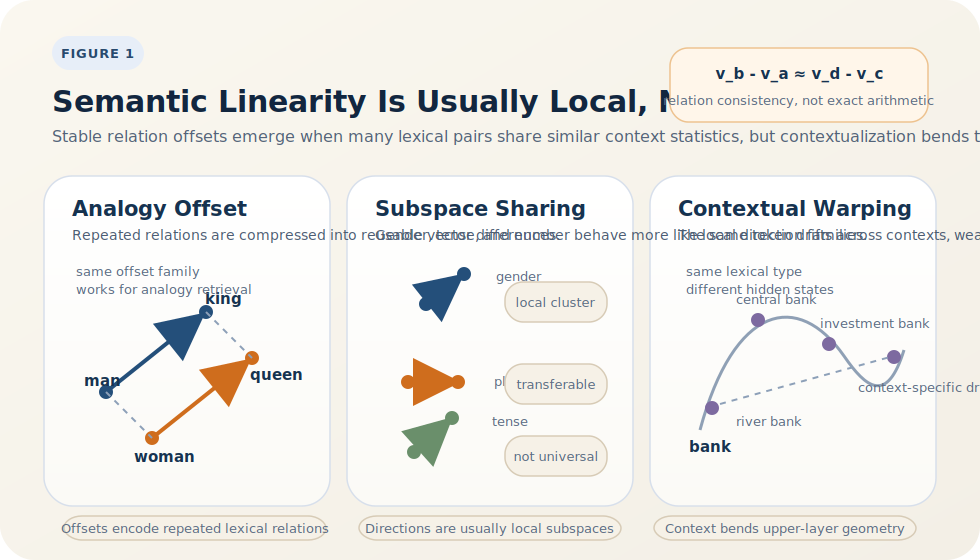

# Semantic Linearity in Embedding Space

<BlogPostLocaleSwitch current-locale="en" zh-path="/blog/representation-space-of-large-models/semantic-linearity" en-path="/blog/representation-space-of-large-models/semantic-linearity-en" />

Semantic linearity has fascinated researchers for a long time not just because examples like `king - man + woman ≈ queen` are memorable, but because they point to a deeper question: why do distributed representations repeatedly compress certain relations into reusable directional offsets? If the phenomenon were accidental, it would not deserve systematic analysis. If it keeps reappearing, we need to ask what statistical mechanism sits underneath it [1-9].

A safer formulation is that linearity in embeddings does not mean natural language obeys some global Euclidean axiom. It means training objectives often discover a low-complexity geometric encoding for recurring co-occurrence structure. The effect is clearest in static word vectors, input embeddings, and output embeddings, and it becomes much weaker in strongly contextual hidden states.

> Core view: semantic linearity in embeddings should usually be understood as a locally stable relation offset rather than a globally perfect semantic axis. It appears because co-occurrence statistics, low-rank factorization, and parameter sharing jointly encourage repeated relations to be encoded as directions, and that directional structure weakens substantially in contextualized representations [1-9].

## 1. What exactly does the linear phenomenon claim?

Let the embeddings of four words be $v_a,v_b,v_c,v_d$. When an analogy holds, the claim is usually not that a word owns some absolute "gender coordinate" or "tense coordinate." The claim is that the displacement between two words matches the displacement between another pair:

$$
v_b - v_a \approx v_d - v_c.
$$

`king - man + woman ≈ queen` is only one instance of this pattern [1][2]. The actual object of interest is consistency of relation vectors:

$$
v_{\text{queen}} - v_{\text{king}}
\approx
v_{\text{woman}} - v_{\text{man}}.
$$

So analogy phenomena do not fundamentally concern isolated word vectors. They concern whether the same relation vector can be reused across many word pairs. If a transformation induces approximately parallel displacements in many places, then nearest-neighbor search can map

$$
v_b - v_a + v_c
$$

to the correct answer.

This already hints at a boundary condition: semantic linearity requires relation types that repeat. If a relation is highly dependent on context, part of speech, or discourse environment, it becomes hard to encode it with one stable direction. Figure 1 is helpful for distinguishing "locally reusable offsets" from "globally fixed semantic axes."

*Figure 1. Semantic linearity is better read as a locally stable relation offset. In token-level representations, some recurring relations become reusable directions; in strongly contextualized spaces, the same token drifts substantially with context.*

So the point of Figure 1 is not a few pleasing parallel lines. It is that the same relation remains stable only inside a limited neighborhood. That is why analogy phenomena are real without being universal laws.

## 2. Why does co-occurrence learning naturally produce displacement structure?

To answer that, we must leave the analogy benchmark itself and return to the training objective. Levy and Goldberg showed that Skip-gram with Negative Sampling can be understood as an implicit factorization of a shifted PMI matrix [4]; Arora et al. further clarified the stable link between word vectors and PMI structure [5]. This family of results can be summarized as

$$
v_w^\top u_c \approx \operatorname{PMI}(w,c) + b_w + b_c,
$$

where $u_c$ is a context vector and $b_w,b_c$ are bias terms.

For any two words $a,b$, subtracting the two sides gives

$$
(v_b - v_a)^\top u_c
\approx
\log \frac{p(c \mid b)}{p(c \mid a)}.
$$

This equation is the key to semantic linearity. It says vector differences are not arbitrary geometry; they approximately encode how much the conditional odds of context $c$ change when we move from word $a$ to word $b$. If two word pairs $(a,b)$ and $(c,d)$ induce similar log-odds shifts across many contexts, then

$$
v_b - v_a \approx v_d - v_c
$$

is a natural low-dimensional compression rather than an accident.

## 3. Why does the model prefer to write relations as directions?

Co-occurrence structure alone is not enough. We also need to explain why the learned low-dimensional space compresses that structure into directional offsets. There are at least three reasons.

- Many semantic or syntactic relations recur repeatedly in the corpus, so they correspond to statistically repeated context changes.
- A low-dimensional embedding cannot memorize each pairwise relation separately. The cheapest option is to let a whole class of recurring transformations share the same directional pattern.
- Downstream readout already relies on inner products, linear maps, and vector addition, so encoding relations as directions maximizes reuse of the model's basic computational primitives.

From a representation-learning perspective, this is a standard low-rank compression strategy. The model does not assign separate parameters to each relation instance. It looks for shared offsets that can be reused across many pairs. Once the reuse is broad enough, linear structure becomes visible in embedding space.

Linearity is therefore not a prior truth about semantics. It is one of the best low-dimensional approximations available to a distributed representation that must compress recurring relations.

## 4. Why is real semantics closer to a subspace than to a single axis?

The most common misunderstanding is to imagine semantic linearity as a collection of global, exact, and independent semantic axes. Reality is much messier. Polysemy superposes several semantic patterns into the same word vector, and different relations couple to one another. Arora et al. argued in 2018 that word-sense structure is better understood as a combination of low-dimensional directional components rather than a single-axis model [6].

So the more precise statement is:

- a relation type often corresponds to a locally stable directional cluster or low-dimensional subspace;
- these directions transfer more reliably within similar lexical classes than across domains or categories;
- the more abstract and context-dependent the relation, the weaker its linear reusability tends to be.

This is why some analogy tasks are stable while others collapse as soon as we move outside a curated vocabulary. Semantic linearity is often a local geometry, not a global coordinate system.

## 5. Why does linearity weaken in contextual representations?

The linear regularities are usually clearest in static word vectors, input embeddings, or output embeddings [7][8]. The reason is straightforward: these representations mainly compress type-level co-occurrence statistics, so stable relation offsets can remain visible.

Once we move into higher contextual layers, the same word drifts with syntax, coreference, topic, and collocational environment. Ethayarajh showed that high-layer representations in BERT, ELMo, and GPT-2 are strongly contextual and anisotropic; a static type-level embedding explains only a small part of their variance [7]. In such spaces, one relation vector cannot continue to explain every instance.

The rough pattern looks like this:

| Representation level | Typical strength of linear regularities | Main reason |
| --- | --- | --- |
| Static word vectors | High | Direct compression of type-level co-occurrence |
| Input/output embeddings | Medium to high | Still retain clear token-level geometry and remain coupled to prediction [8] |
| Mid/high contextual states | Medium to low | Context, position, and task-related factors keep rewriting the representation [7] |

So semantic linearity has not disappeared inside large models, but it survives most clearly in the parts of the system closest to a learned lexicon.

## 6. Which kinds of relations are most likely to break linearity?

Once we treat semantic linearity as low-dimensional compression of recurring relations, its failure modes become easier to state. The easiest relations to encode with a single direction are roughly translational ones: the same transformation can act on many items and induces relatively stable context-ratio changes. By contrast, the following patterns tend to break the single-offset assumption:

- one-to-many or many-to-one relations, where the same word can play several semantic roles;
- strongly hierarchical or set-like relations, which behave more like branching than translation;
- relations that depend heavily on syntactic position or discourse role;
- polysemy-driven relations, because one static vector must carry multiple incompatible directions [6][7].

That is why early analogy benchmarks look strongest on morphology, gender contrasts, or tense changes, yet much weaker on discourse semantics, pragmatics, or heavily context-dependent relations. Linearity is not wrong. It is just only responsible for the part of language that really behaves like a repeated transformation.

## 7. Why is the group-and-symmetry view still useful?

If a change such as singular-to-plural or present-to-past is treated as a repeated transformation acting across many words, embedding learning can be viewed as discovering shared transformation structure in data. Formally, if an operation $g$ satisfies

$$
v_{g \cdot x} \approx T_g v_x,
$$

in a local neighborhood, then a first-order approximation to $T_g$ leads to the linear-offset picture. This matches the intuition behind equivariant representation learning: shared transformation structure reduces sample complexity and improves generalization [9].

But restraint is important. Natural language is not a strict group-action system, and semantic transformations do not satisfy global closure or exact equivariance. The symmetry viewpoint is a useful analytic lens, not a literal axiom system for language.

## 8. Closing

Semantic linearity in embeddings does not mean language has been fully Euclideanized. A better reading is this: when a model must compress large-scale co-occurrence statistics into a finite-dimensional space, the most stable and reusable relations tend to be written as directions. That is why analogy phenomena matter. They reveal a deeper bias of representation learning: shared relations are preferred to instance-by-instance memorization, and local linear structure is preferred to scattered special cases.

Compressed into one sentence: **semantic directions are not a prior law of language; they are a geometric consequence of low-dimensional compression of recurring relations in distributed representations.** Push that logic outward, and the whole vocabulary begins to look like a semantically constrained high-dimensional codebook.

## References

[1] MIKOLOV T, YIH W-T, ZWEIG G. Linguistic Regularities in Continuous Space Word Representations[C]// *Proceedings of the 2013 Conference of the North American Chapter of the Association for Computational Linguistics: Human Language Technologies*. Atlanta, Georgia: Association for Computational Linguistics, 2013: 746-751. URL: [https://aclanthology.org/N13-1090/](https://aclanthology.org/N13-1090/).

[2] MIKOLOV T, SUTSKEVER I, CHEN K, et al. Distributed Representations of Words and Phrases and their Compositionality[C]// *Advances in Neural Information Processing Systems 26*. Red Hook, NY: Curran Associates, 2013: 3111-3119. URL: [https://papers.nips.cc/paper/5021-distributed-representations-of-words-and-phrases-and-their-compositionality](https://papers.nips.cc/paper/5021-distributed-representations-of-words-and-phrases-and-their-compositionality).

[3] PENNINGTON J, SOCHER R, MANNING C D. GloVe: Global Vectors for Word Representation[C]// *Proceedings of the 2014 Conference on Empirical Methods in Natural Language Processing (EMNLP)*. Doha, Qatar: Association for Computational Linguistics, 2014: 1532-1543. DOI: [10.3115/v1/D14-1162](https://doi.org/10.3115/v1/D14-1162).

[4] LEVY O, GOLDBERG Y. Neural Word Embedding as Implicit Matrix Factorization[C]// *Advances in Neural Information Processing Systems 27*. Red Hook, NY: Curran Associates, 2014: 2177-2185. URL: [https://papers.nips.cc/paper/5477-neural-word-embedding-as-implicit-matrix-factorization](https://papers.nips.cc/paper/5477-neural-word-embedding-as-implicit-matrix-factorization).

[5] ARORA S, LI Y, LIANG Y, et al. A Latent Variable Model Approach to PMI-based Word Embeddings[J]. *Transactions of the Association for Computational Linguistics*, 2016, 4: 385-399. DOI: [10.1162/tacl_a_00106](https://doi.org/10.1162/tacl_a_00106).

[6] ARORA S, LI Y, LIANG Y, et al. Linear Algebraic Structure of Word Senses, with Applications to Polysemy[J]. *Transactions of the Association for Computational Linguistics*, 2018, 6: 483-495. DOI: [10.1162/tacl_a_00034](https://doi.org/10.1162/tacl_a_00034).

[7] ETHAYARAJH K. How Contextual are Contextualized Word Representations? Comparing the Geometry of BERT, ELMo, and GPT-2 Embeddings[C]// *Proceedings of the 2019 Conference on Empirical Methods in Natural Language Processing and the 9th International Joint Conference on Natural Language Processing (EMNLP-IJCNLP)*. Hong Kong, China: Association for Computational Linguistics, 2019: 55-65. DOI: [10.18653/v1/D19-1006](https://doi.org/10.18653/v1/D19-1006).

[8] PRESS O, WOLF L. Using the Output Embedding to Improve Language Models[C]// *Proceedings of the 15th Conference of the European Chapter of the Association for Computational Linguistics: Volume 2, Short Papers*. Valencia, Spain: Association for Computational Linguistics, 2017: 157-163. URL: [https://aclanthology.org/E17-2025/](https://aclanthology.org/E17-2025/).

[9] KONDOR R, TRIVEDI S. On the Generalization of Equivariance and Convolution in Neural Networks to the Action of Compact Groups[C]// *Proceedings of the 35th International Conference on Machine Learning*. PMLR, 2018: 2747-2755. URL: [https://proceedings.mlr.press/v80/kondor18a.html](https://proceedings.mlr.press/v80/kondor18a.html).
