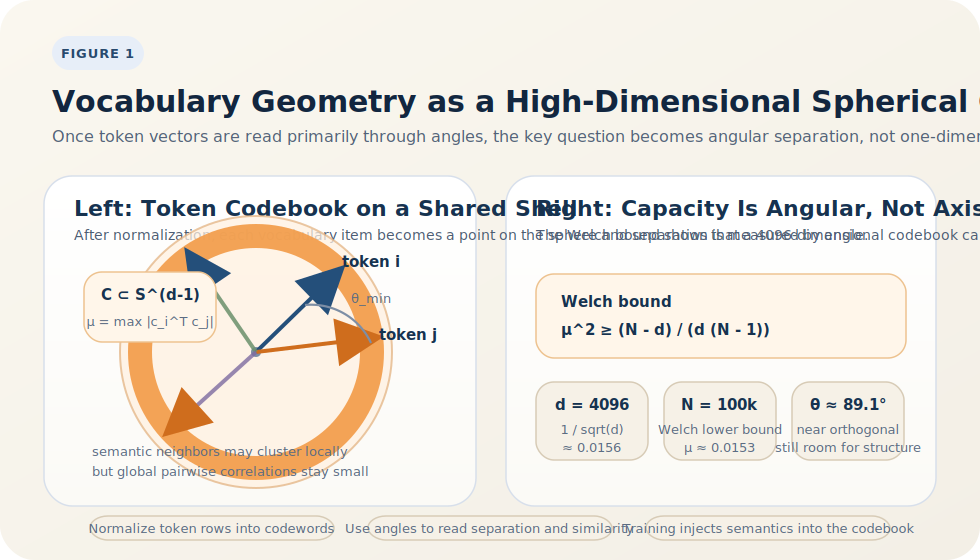

# A Spherical-Coding View of LLM Embeddings

<BlogPostLocaleSwitch current-locale="en" zh-path="/blog/representation-space-of-large-models/spherical-coding" en-path="/blog/representation-space-of-large-models/spherical-coding-en" />

An LLM vocabulary embedding matrix often contains tens of thousands or even hundreds of thousands of tokens, while the representation dimension is only a few thousand. If we rely on low-dimensional linear-algebra intuition, it is easy to conclude that such a system must be overcrowded. But capacity is not determined by whether the dimension exceeds the vocabulary size. It is determined by whether the normalized directions can maintain sufficiently low correlation [1-9].

That is where the spherical-coding viewpoint begins. Once each token embedding is normalized, the whole vocabulary becomes a point set on the unit sphere: a high-dimensional codebook constrained by semantics, frequency, and the prediction objective. The problem then changes from "can each token get its own dimension?" to "how many directions remain reliably distinguishable at this dimension?"

> Core view: treating normalized token embeddings as a spherical code is not mere rhetoric. It is a strong first-order model that explains three key facts: representations are mostly read through directional relations, vocabulary capacity is controlled mainly by angular separation and coherence, and training then writes semantic, frequency, and predictive structure into that high-dimensional codebook [1-9].

## 1. From the vocabulary matrix to a spherical codebook

Let the embedding matrix be

$$
E \in \mathbb{R}^{V \times d},
$$

where $V$ is the vocabulary size and $d$ is the embedding dimension. If each row is normalized as

$$
\hat e_i = \frac{e_i}{\|e_i\|},
$$

then the vocabulary can be written as

$$
C = \{\hat e_1,\dots,\hat e_V\} \subset \mathbb{S}^{d-1}.
$$

In coding theory, such a set is a spherical code [1][2]. Two basic quantities measure whether it is well separated:

$$
\theta_{\min}(C) = \min_{i \neq j} \arccos(\hat e_i^\top \hat e_j)
$$

for minimum angular separation, and

$$
\mu(C) = \max_{i \neq j} |\hat e_i^\top \hat e_j|
$$

for maximum coherence. Larger minimum angles and smaller coherence make codewords easier to distinguish. So once embeddings are mainly read through inner products or cosine similarity, vocabulary geometry naturally becomes a spherical-code problem.

## 2. Why is this viewpoint especially natural for language models?

Many of the key computations in language models already prefer directional readout. Input embeddings, output-layer logits, normalized similarity measures, and many retrieval operations are fundamentally inner-product based. Press and Wolf also showed that output embeddings are not a side module of the prediction head; they are a core part of language-model quality, and when input and output embeddings are tied or strongly coupled, the two geometries influence one another [5].

At the same time, earlier articles in this blog have argued that high-dimensional representations naturally move toward norm concentration and directional organization [4][6][7]. So although real LLM embeddings are not explicitly optimized as ideal spherical codes, their effective geometry often gets close to a "length-controlled, direction-dominated, inner-product-readable" codebook. Figure 1 makes that reformulation explicit.

*Figure 1. Once the normalized vocabulary is treated as a spherical code, the main question is no longer whether the dimension is larger than the vocabulary, but whether angular separation and maximum mutual coherence remain usable.*

The key move in Figure 1 is that it replaces the linear-algebra intuition "more objects than dimensions must be bad" with the high-dimensional geometric question "can the angular spacing still be maintained?" The discussion of the Welch bound below is just the quantitative version of that picture.

## 3. Why can a few thousand dimensions hold a vocabulary of one hundred thousand tokens?

This is where the spherical-coding view becomes immediately explanatory. For a set of unit vectors, the classical Welch bound gives [2]

$$
\mu(C)^2 \ge \frac{V-d}{d(V-1)}.
$$

If we plug in $V = 100000$ and $d = 4096$, we get

$$
\mu(C) \ge \sqrt{\frac{100000-4096}{4096 \cdot 99999}} \approx 0.0153.
$$

The corresponding angular lower bound is

$$
\arccos(0.0153) \approx 89.1^\circ.
$$

This number matters. It says that even in an ideal uniform arrangement, putting `100k` unit vectors into `4096` dimensions only requires the worst-case cosine similarity to be no smaller than about `0.0153`. For random unit vectors in high dimension, the typical inner-product fluctuation is already

$$
\operatorname{Std}(\hat x^\top \hat y) \approx \frac{1}{\sqrt{d}} = \frac{1}{64} \approx 0.0156.
$$

That is almost the same scale as the Welch lower bound [2][3]. So from a purely geometric-capacity perspective, fitting a `100k` vocabulary into `4096` dimensions is not strained at all. The harder problem is not whether the geometry can hold the tokens, but how to preserve semantic, frequency, and predictive structure while doing so.

The same order-of-magnitude estimate gives:

| Vocabulary size $V$ | Dimension $d$ | Welch lower bound $\mu_{\min}$ | Angular lower bound |
| --- | --- | --- | --- |
| `50k` | `4096` | `0.01497` | `89.14^\circ` |
| `100k` | `4096` | `0.01530` | `89.12^\circ` |
| `200k` | `4096` | `0.01546` | `89.11^\circ` |

When $V \gg d$, the controlling scale is already very close to $1/\sqrt{d}$. That is why the real limits of vocabulary design are not "the geometry cannot fit," but the higher-level statistical and optimization constraints.

## 4. Why is a real vocabulary not an ideal uniform code?

An ideal spherical code aims for globally uniform spreading. A real language model aims for task-relevant nonuniform organization. High-frequency function words, content words, semantically similar tokens, morphological variants, and special symbols cannot remain perfectly symmetric on the sphere. Training must deviate from purely geometric optimality in order to gain predictive usefulness.

This shows up in at least three kinds of structural bias:

- frequency bias: high-frequency tokens play a special role in the output head, so their geometry and biases are shaped by token frequency [8];
- semantic locality: semantically related tokens form local clusters rather than being uniformly scattered over the whole sphere;
- computational readability: attention, linear layers, and the softmax head must all read these vectors efficiently, so the geometry must serve later computation, not just maximize angular separation.

So the best description is not "an ideal spherical code," but "a spherical-code approximation constrained jointly by semantics, frequency, and prediction."

## 5. Why does sufficient capacity not imply easy training?

The Welch bound is a capacity constraint, not an optimization guarantee. It tells us how small coherence can possibly become for a given vocabulary size and dimension, but it does not say gradient descent will actually find something close to that optimum. In other words, spherical-code theory answers "can the geometry fit these points?" not "can training easily discover the right arrangement?"

Real vocabulary geometry is harder for at least three reasons:

- word frequencies are extremely imbalanced, so head tokens receive many updates while long-tail tokens may stay undertrained;
- input embeddings, output embeddings, and the softmax head are often coupled, so the same codebook must serve both representation and prediction [5][8];
- semantic locality requires some tokens to form explicit clusters, which sacrifices part of the globally uniform spacing.

So even when the space can geometrically hold hundreds of thousands of tokens, a near-optimal codebook is still difficult to learn. The spherical-coding view is valuable precisely because it separates the question of geometric capacity from the question of optimization difficulty.

## 6. What can this viewpoint explain, and what can it not explain?

At minimum, it explains three central facts:

- why cosine similarity often feels more natural than raw Euclidean distance: if the representation lives mainly on a sphere, angle is the primary variable;
- why a huge vocabulary does not automatically crowd out the embedding space: the directional capacity of a high-dimensional sphere is far larger than low-dimensional intuition suggests;
- why global separability and local similarity can coexist: spherical coding asks for overall low correlation, not equal spacing everywhere.

But the viewpoint has clear limits:

- it does not by itself explain contextualized semantics, because hidden states are continually rewritten by context and depth [6][7];
- it does not guarantee isotropy, since pretrained language models often retain strong frequency biases and anisotropic hot directions [6-8];
- it does not require strict unit norm for all vectors; the better statement is that normalized directional geometry is often the most stable first-order approximation.

So the best use of the spherical-coding lens is as a dominant model of vocabulary geometry, not as the whole truth.

## 7. Closing

Once the embedding table is seen as a high-dimensional codebook, many scattered observations fall into place: near-orthogonality explains capacity, shell geometry explains why direction matters more than length, the Welch bound explains why a few thousand dimensions are enough for a huge vocabulary, and the training objective explains why the real codebook must carry frequency and semantic structure.

Put differently, **an embedding table is not just a loose parameter matrix. It is a trained high-dimensional semantic codebook.** The spherical-coding view does not exhaust all the complexity of LLM representations, but it captures the hardest geometric constraint governing vocabulary organization.

## References

[1] CONWAY J H, SLOANE N J A. *Sphere Packings, Lattices and Groups*[M]. 3rd ed. New York: Springer, 1999. DOI: [10.1007/978-1-4757-6568-7](https://doi.org/10.1007/978-1-4757-6568-7).

[2] DATTA S, HOWARD S D, COCHRAN D. Geometry of the Welch Bounds[J]. *Linear Algebra and its Applications*, 2012, 437(10): 2455-2470. DOI: [10.1016/j.laa.2012.05.036](https://doi.org/10.1016/j.laa.2012.05.036).

[3] CAI T T, FAN J, JIANG T. Distributions of Angles in Random Packing on Spheres[J]. *Journal of Machine Learning Research*, 2013, 14(57): 1837-1864. URL: [https://jmlr.org/papers/v14/cai13a.html](https://jmlr.org/papers/v14/cai13a.html).

[4] WANG T, ISOLA P. Understanding Contrastive Representation Learning through Alignment and Uniformity on the Hypersphere[C]// *Proceedings of the 37th International Conference on Machine Learning*. PMLR, 2020: 9929-9939. URL: [https://proceedings.mlr.press/v119/wang20k.html](https://proceedings.mlr.press/v119/wang20k.html).

[5] PRESS O, WOLF L. Using the Output Embedding to Improve Language Models[C]// *Proceedings of the 15th Conference of the European Chapter of the Association for Computational Linguistics: Volume 2, Short Papers*. Valencia, Spain: Association for Computational Linguistics, 2017: 157-163. URL: [https://aclanthology.org/E17-2025/](https://aclanthology.org/E17-2025/).

[6] LI B, ZHOU H, HE J, et al. On the Sentence Embeddings from Pre-trained Language Models[C]// *Proceedings of the 2020 Conference on Empirical Methods in Natural Language Processing (EMNLP)*. Online: Association for Computational Linguistics, 2020: 9119-9130. DOI: [10.18653/v1/2020.emnlp-main.733](https://doi.org/10.18653/v1/2020.emnlp-main.733).

[7] GAO T, YAO X, CHEN D. SimCSE: Simple Contrastive Learning of Sentence Embeddings[C]// *Proceedings of the 2021 Conference on Empirical Methods in Natural Language Processing*. Online and Punta Cana, Dominican Republic: Association for Computational Linguistics, 2021: 6894-6910. DOI: [10.18653/v1/2021.emnlp-main.552](https://doi.org/10.18653/v1/2021.emnlp-main.552).

[8] KOBAYASHI G, KURIBAYASHI T, YOKOI S, et al. Transformer Language Models Handle Word Frequency in Prediction Head[C]// *Findings of the Association for Computational Linguistics: ACL 2023*. Toronto, Canada: Association for Computational Linguistics, 2023: 4523-4535. DOI: [10.18653/v1/2023.findings-acl.276](https://doi.org/10.18653/v1/2023.findings-acl.276).

[9] DUAN Y, LU J, ZHOU J. UniformFace: Learning Deep Equidistributed Representation for Face Recognition[C]// *Proceedings of the IEEE/CVF Conference on Computer Vision and Pattern Recognition*. 2019: 3415-3424. URL: [https://openaccess.thecvf.com/content_CVPR_2019/html/Duan_UniformFace_Learning_Deep_Equidistributed_Representation_for_Face_Recognition_CVPR_2019_paper.html](https://openaccess.thecvf.com/content_CVPR_2019/html/Duan_UniformFace_Learning_Deep_Equidistributed_Representation_for_Face_Recognition_CVPR_2019_paper.html).
