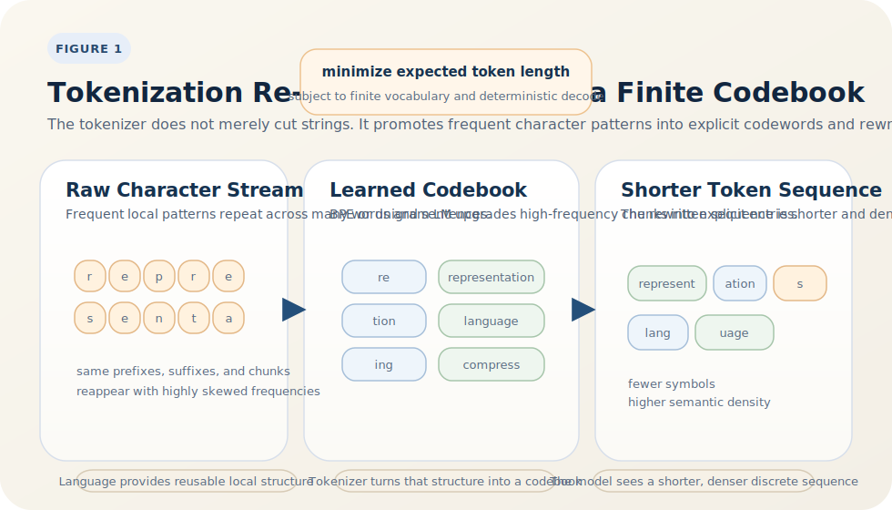

# What Tokenization Really Does

<BlogPostLocaleSwitch current-locale="en" zh-path="/blog/theory-of-tokenizers/what-tokenization-does" en-path="/blog/theory-of-tokenizers/what-tokenization-does-en" />

If a tokenizer is understood only as a preprocessing tool that splits text into tokens, we miss its real role in the language-model system. Different tokenizers strongly affect sequence length, vocabulary size, long-tail handling, and optimization difficulty during training. If tokenization were a neutral segmentation step, these systematic differences would be hard to explain [1][3-5].

A more accurate view is that tokenization is first a problem of designing a finite reversible codebook. Its aim is not to find the most linguistically natural segmentation, but to re-encode raw strings into a shorter, more stable, and more neural-network-friendly discrete sequence while preserving recoverable text information.

> Core claim: the first job of a tokenizer is not to "recognize words," but to outsource high-frequency local structure in language to an explicit codebook. This shortens sequences, reduces statistical redundancy, and leaves more model capacity for genuine contextual modeling. Subword methods have dominated modern LLMs because they provide the most effective trade-off among compression efficiency, open vocabulary, and optimization stability [1-5].

## 1. What kind of object should a tokenizer be?

Let the raw text be a string $x$, and let the tokenizer output a token sequence

$$
\tau(x) = (t_1,\dots,t_m),
$$

with a deterministic reverse map $\gamma$ such that

$$
\gamma(t_1)\gamma(t_2)\cdots\gamma(t_m) = x
$$

or at least reconstructs the normalized text space. The essence of a tokenizer is therefore not arbitrary segmentation, but the construction of a **reversible variable-length coding system over a finite vocabulary**.

If the output length is

$$
T_\tau(x) = m,
$$

then a rough objective is

$$
\min_\tau \ \mathbb{E}_{x \sim \mathcal{D}}[T_\tau(x)],
$$

subject to the constraints that

- encoding and decoding remain deterministic;
- vocabulary capacity is finite;
- long-tail inputs remain representable;
- the resulting sequence stays friendly to downstream neural models.

This definition already shows that tokenization is codebook design from the start, not merely a linguistic operation.

## 2. Why is natural language compressible in the first place?

Compression works not because the tokenizer is clever in isolation, but because language distributions are highly skewed. Zipf's law says that a small set of very frequent units carries most of the probability mass, while the rest of the vocabulary forms a long tail [2]. That means text contains many reusable patterns:

- high-frequency function words repeat constantly;
- common stems, affixes, and subword fragments recur across many words;
- punctuation, whitespace patterns, and byte chunks repeat at scale;
- many rare words can be composed from more frequent local pieces.

From Shannon's perspective, that is exactly what makes a source compressible: when the symbol distribution is skewed, average description length can be reduced significantly through nonuniform coding [1]. A tokenizer exploits that skew by promoting high-frequency local patterns into explicit entries in the codebook.

## 3. What are BPE and unigram LM actually doing?

Modern LLM tokenizers do not usually start from whole words. They start from characters, bytes, or smaller pieces and learn an intermediate-granularity codebook. The two most common approaches are BPE and unigram language models.

### BPE: greedily writing high-gain fragments into the codebook

After Sennrich et al. introduced BPE to neural machine translation, subword tokenization quickly became dominant [3]. Its core loop is:

1. start from a character- or byte-level vocabulary;
2. count adjacent fragment pairs;
3. merge the pair with the highest gain;
4. repeat until the target vocabulary size is reached.

From a compression viewpoint, each merge asks the same question: if a high-frequency local pattern is promoted to its own codeword, does the average encoded length of the corpus go down?

### Unigram LM: treating segmentation itself as a probabilistic model

Kudo's unigram LM instead models segmentation as a probability distribution over a fixed vocabulary [5]. Rather than greedily merging symbols, it explicitly scores different segmentations and keeps the subword units that matter most under approximate maximum likelihood. SentencePiece systematized this idea further and made it possible to train a tokenizer directly on raw text while treating vocabulary size as a first-class constraint [4].

So whether the tokenizer is BPE or unigram LM, the central question is not "where should language be cut?" but "under a fixed codebook budget, which fragments are worth memorizing as atomic units?" Figure 1 compresses that viewpoint into one picture.

*Figure 1. The more accurate role of a tokenizer is to extract reusable high-frequency fragments from the raw character stream, store them in a finite codebook, and then re-encode text into a shorter and more stable discrete sequence.*

Figure 1 focuses not on the exact location of boundaries, but on which local structures are elevated into the explicit codebook. That is why tokenization affects both compression efficiency and inductive bias.

## 4. Why has subword tokenization become the stable solution for LLMs?

Different tokenization granularities are really different ways of deciding how to split work between the explicit codebook and the neural network's internal composition.

| Granularity | Main advantage | Main cost |
| --- | --- | --- |
| word-level | short sequences, high semantic density per token | severe OOV issues, poor long-tail handling |
| character/byte-level | open vocabulary, unified cross-language representation | sequences become too long, local composition becomes expensive |
| subword | balances compression, openness, and learnability | requires codebook training, segmentation is not always linguistically natural |

Subword methods win precisely because they are not extreme. They do three important system-level jobs:

- absorb a large amount of high-frequency local structure into the codebook and substantially shorten sequences;
- preserve open-vocabulary behavior so rare words can still be composed from smaller pieces;
- provide the model with intermediate-granularity units, so it does not always have to rediscover common lexical structure from character streams.

Subword tokenization is therefore not the linguistically purest segmentation. It is one of the most effective ways to divide labor inside the whole system.

## 5. What exactly does a tokenizer compress?

Here we need a careful distinction. A tokenizer is not optimizing bit-level compression in isolation. It is compressing the complexity of the neural network's input representation. At least three things are being compressed at once.

### Sequence length

Once frequent fragments are turned into tokens, the same text becomes a shorter sequence. For Transformers, that directly changes attention cost, cache usage, and the effective value of the context window.

### Statistical redundancy

If some local pattern appears repeatedly, hard-coding it as a token stores that repetition in the explicit codebook instead of forcing the model to rediscover it every time from characters.

### Learning difficulty

When frequent patterns appear as stable tokens, embeddings and later layers can learn reusable representations more easily. Otherwise the model must first solve low-level composition before it can begin real semantic modeling.

So tokenization does not just compress text. It compresses the space of local structure that the model would otherwise need to search and relearn repeatedly.

## 6. What inductive biases does tokenization inject?

Once tokenization is seen as compression, one more step is necessary: the compressor is not neutral. Fixing a codebook also decides which statistical regularities the model gets to reuse easily, which local boundaries it tends to ignore, and which string fragments count as naturally reusable units.

That means tokenization injects at least three kinds of inductive bias:

- segmentation bias: the model shares statistics more easily within token boundaries than across them;
- lexical bias: in some languages, subword boundaries align reasonably well with morphology; in others, they do not, which directly changes the difficulty of learning rare and complex forms;
- normalization bias: case handling, whitespace, punctuation, byte normalization, and Unicode conventions all change the discrete symbol system the model actually sees.

So the role of a tokenizer cannot be summarized as "how many characters did it compress?" It also decides the granularity at which the model sees recurring structure in language. Compression and inductive bias are two sides of the same design choice.

## 7. Closing

The core of tokenization is not merely cutting text into pieces. It is deciding which local structures should be handled by an explicit codebook and which should be left for the neural network to assemble in context. Once that is clear, the tokenizer stops looking like a peripheral preprocessing step and becomes one of the central places where an LLM system allocates compression, generalization, and computation.

Put compactly, **a tokenizer is first a neural-network-friendly compression system.** Once we adopt the codebook view, the next unavoidable question is why vocabulary size does not keep growing forever, but settles near a moderate operating point.

## References

[1] SHANNON C E. A Mathematical Theory of Communication[J]. *Bell System Technical Journal*, 1948, 27(3): 379-423; 27(4): 623-656. URL: [https://www.mpi.nl/publications/item2383162/mathematical-theory-communication](https://www.mpi.nl/publications/item2383162/mathematical-theory-communication).

[2] PIANTADOSI S T. Zipf's Word Frequency Law in Natural Language: A Critical Review and Future Directions[J]. *Psychonomic Bulletin & Review*, 2014, 21(5): 1112-1130. DOI: [10.3758/s13423-014-0585-6](https://doi.org/10.3758/s13423-014-0585-6).

[3] SENNRICH R, HADDOW B, BIRCH A. Neural Machine Translation of Rare Words with Subword Units[C]// *Proceedings of the 54th Annual Meeting of the Association for Computational Linguistics (Volume 1: Long Papers)*. Berlin, Germany: Association for Computational Linguistics, 2016: 1715-1725. DOI: [10.18653/v1/P16-1162](https://doi.org/10.18653/v1/P16-1162).

[4] KUDO T, RICHARDSON J. SentencePiece: A Simple and Language Independent Subword Tokenizer and Detokenizer for Neural Text Processing[C]// *Proceedings of the 2018 Conference on Empirical Methods in Natural Language Processing: System Demonstrations*. Brussels, Belgium: Association for Computational Linguistics, 2018: 66-71. DOI: [10.18653/v1/D18-2012](https://doi.org/10.18653/v1/D18-2012).

[5] KUDO T. Subword Regularization: Improving Neural Network Translation Models with Multiple Subword Candidates[C]// *Proceedings of the 56th Annual Meeting of the Association for Computational Linguistics (Volume 1: Long Papers)*. Melbourne, Australia: Association for Computational Linguistics, 2018: 66-75. DOI: [10.18653/v1/P18-1007](https://doi.org/10.18653/v1/P18-1007).
