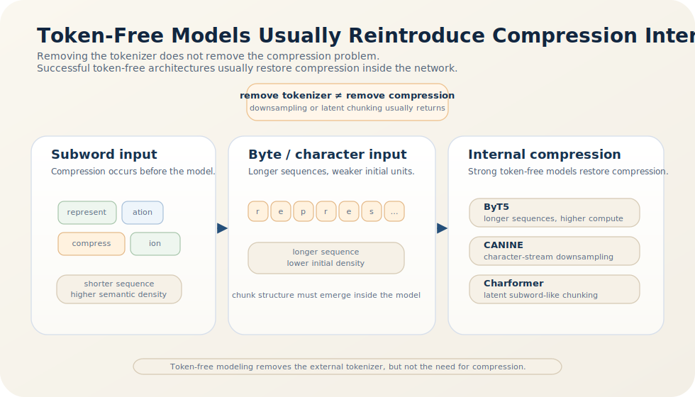

# Character-Level Tokenizer 的理论优势与工程局限

如果只从表示统一性出发，character-level 或 byte-level 路线几乎无可挑剔：它没有 OOV 问题，不依赖手工词表边界，对新词、新脚本和噪声拼写也更自然。问题在于，表示上的统一并不自动转化为系统上的高效。主流大模型之所以长期停留在 subword 路线，并不是因为字符级方案不能表达语言，而是因为它往往不能在整体计算与优化成本上获胜 [1-5]。

更严格地说，字符级建模并没有消灭压缩需求；它只是拒绝在模型外部显式完成压缩，于是这些工作必须在更长的序列上由网络自己重新学出来。

> 核心结论：character-level 或 token-free 方法确实带来开放词表、噪声鲁棒性与跨语言统一性，但它们通常需要更长序列、更长的语义形成路径以及额外的结构补偿；现代最成功的 token-free 模型几乎都会显式或隐式地重新引入下采样、局部块化或潜在 subword 偏置，这恰恰说明压缩并未消失，而是从显式 tokenizer 转移到了模型内部 [1-5]。

在“Tokenizer 的理论”系列中，本文承接上一篇 [LLM 词表规模的自然平衡点](/blog/theory-of-tokenizers/why-vocab-size-stays-near-50k)，把词表继续缩小到字符级，检验显式码本退出后系统要补回哪些代价；若要回看这一组讨论的起点，可先读 [Tokenization 的压缩本质](/blog/theory-of-tokenizers/what-tokenization-does)。

## 1. 为什么字符级方案看起来如此有吸引力？

ByT5 总结过 token-free 模型最常被强调的优势 [1]：

- 对任何语言、任何新词都天然开放；
- 对拼写噪声、字符扰动和非标准文本更鲁棒；
- 减少 tokenizer 训练、部署与兼容性上的工程负担；
- 不再需要预先决定哪些字符串应该被切成独立 token。

这些优点都是真实的。尤其在多语言、噪声文本或输入规范经常变化的场景中，字符级统一表示确实很有吸引力。问题在于，统一输入形式并不意味着后续模型就更容易学习高层语义。

## 2. 第一个代价：序列长度会把所有计算都放大

字符或字节是最细粒度的书写单位，一个 subword token 往往对应多个字符。因此，同一段文本在 token-free 方案下通常会展开成更长的序列。ByT5 也明确指出，token-free 路线必须支付更长序列带来的训练与推理代价 [1]。

这会连锁影响几乎所有 Transformer 成本：

- attention 计算更重；
- KV cache 更大；
- 固定上下文窗口容纳的真实文本更少；
- 模型必须花更多层数，先把低层局部模式重新组合成更稳定的中层单元。

因此，character-level 不是“不压缩”，而是把压缩压力转移到了更靠后的网络部分。

## 3. 第二个代价：语义形成路径更长

从优化角度看，字符级方案更深层的困难并不只是算得更慢，而是语义必须经过更长的组合链条才能形成。

在 subword 方案中，模型一开始就能看到具有一定语义密度的单元，例如高频词根、前后缀或常见拼写块。相反，在字符级方案中，底层输入本身几乎不携带稳定语义，模型必须先学会：

1. 哪些字符应当绑定成局部片段；
2. 哪些片段进一步形成词法上稳定的中层单元；
3. 这些中层单元如何再进入更高层的语义与上下文关系。

这意味着有效任务梯度必须穿过更长的组合路径，才能影响到底层表示。训练早期因此更容易被表面拼写模式、局部重复和短程相关性占据，而较难快速形成紧凑的中层语义结构。

## 4. 第三个代价：标准 Transformer 并不偏爱原始字符流

标准 Transformer 的 inductive bias 更适合在已有一定语义密度的离散单元之间建立全局依赖，而不是先从极长原始字符流中恢复局部块结构，再在其上继续做高层建模。换句话说，它最擅长的是：

- 在中间粒度单元之间建立关系；
- 借助多层注意力反复重写表示；
- 在已有局部结构之上开展全局依赖计算。

它并不天然擅长的是：

- 从极长字符流中恢复词法块；
- 在恢复局部块的同时还保持计算高效；
- 把“先学压缩”与“再学语义”同时做好。

这也是为什么 subword tokenizer 虽然只是前处理，却恰好承担了 Transformer 最不擅长的一部分底层工作。

## 5. 现代 token-free 模型如何补偿这些缺陷？

真正说明问题的，不是字符级方法能否工作，而是那些表现最好的 token-free 模型几乎都需要在模型内部重新做压缩。图 1 正好把这件事画成一条很清楚的系统路径。

*图 1. token-free 方法想要变得实用，通常都要在网络内部重新引入某种压缩机制：下采样、局部块化或潜在 subword。压缩并没有消失，只是从显式 tokenizer 转移到了模型内部。*

图 1 的关键不是某一种具体补偿模块，而是压缩职责的迁移方向：从外部显式码本迁移到网络内部模块。后文列举的 ByT5、CANINE 与 Charformer，本质上都在填这张图中的不同位置。

### ByT5：接受更长序列的代价

ByT5 证明，标准 Transformer 可以直接处理字节序列，并在噪声鲁棒性等场景中展现出明显优势 [1]。但它同样清楚报告了 token-free 路线在训练 FLOPs、推理速度和序列长度上的显著成本。ByT5 的结论不是“tokenizer 没必要”，而是“在愿意支付更高代价时，token-free 可以带来若干系统收益”。

### CANINE：显式下采样

CANINE 的关键创新并不是“直接喂字符”本身，而是引入下采样，把超长字符序列先压缩成更短的中间表示，再交给深层 Transformer [2]。这本质上就是把显式 tokenizer 的部分工作移入模型内部。

### Charformer：学习潜在 subword

Charformer 更进一步，直接在模型内部学习基于字符块的潜在分词结构。其 GBST 模块通过枚举候选块并学习权重，形成一种端到端的 latent subword tokenization [3]。这说明即便放弃显式 tokenizer，模型最终仍往往会重新发明某种中间粒度单元。

因此，现代 token-free 路线的共同点不是“彻底取消压缩”，而是“把压缩做成网络内部的可学习组件”。

## 6. 所以 character-level 究竟输在哪里？

把前面几部分合起来，character-level 方案通常在三个维度上同时承压：

- 计算效率更差，因为序列更长；
- 优化路径更长，因为中层结构必须由模型自己恢复；
- 架构匹配更弱，因为标准 Transformer 并不是最理想的原始字符组合器。

因此，字符级方案的问题不是理论表达力不足，而是**在当前主流架构和预算下，整体系统代价通常更高**。这也是为什么 subword tokenizer 仍然长期占据默认位置：它在模型之外先做掉一部分局部压缩，让 Transformer 可以更早进入自己真正擅长的全局关系建模阶段 [4][5]。

## 7. 哪些场景下字符级路线反而值得采用？

上面的分析并不意味着 character-level 永远不值得选。恰恰相反，在某些明确场景下，它的系统优势会变得非常真实。

- 当输入噪声大、拼写变化剧烈，或者 OCR、社交媒体文本、用户生成内容中存在大量非标准写法时，字符级表示的鲁棒性会明显上升 [1]。
- 当任务必须覆盖极多脚本、极多新词或高频出现未登录形式时，开放词表的价值会显著增加。
- 当研究目标本身就是减少 tokenizer 技术债、统一多语言输入管线或检验模型能否自行恢复中层结构时，token-free 路线也具有方法论意义。

因此，问题不应被表述为“字符级是否正确”，而应被表述为“在当前任务里，开放性与鲁棒性是否值得我们支付更长序列和更高优化成本”。一旦这个交换条件成立，character-level 完全可能是合理方案。

## 8. 结语

character-level 路线最容易被高估的地方，是它看起来取消了 tokenizer，于是似乎也取消了词法层面的工程折中。实际上，压缩和中间结构发现这件事无论如何都要发生；区别只在于，它是由一个显式码本在模型外部完成，还是由更深、更贵的网络在模型内部重新学出。

归结起来，**字符级方法通常输的不是表示能力，而是系统分工。** 当显式 subword tokenizer 已经能够以更低代价提供稳定压缩时，完全字符级路线就很难在整体效率上胜出；也正因如此，最成功的 token-free 模型往往最终都会重新引入某种“隐式 tokenizer”。

上一篇：[LLM 词表规模的自然平衡点](/blog/theory-of-tokenizers/why-vocab-size-stays-near-50k)。回到起点：[Tokenization 的压缩本质](/blog/theory-of-tokenizers/what-tokenization-does)。

## 参考文献

[1] XUE L, BARUA A, CONSTANT N, et al. ByT5: Towards a Token-Free Future with Pre-trained Byte-to-Byte Models[J]. *Transactions of the Association for Computational Linguistics*, 2022, 10: 291-306. DOI: [10.1162/tacl_a_00461](https://doi.org/10.1162/tacl_a_00461).

[2] CLARK J H, GARRETTE D, TURC I, et al. CANINE: Pre-training an Efficient Tokenization-Free Encoder for Language Representation[J]. *Transactions of the Association for Computational Linguistics*, 2022, 10: 73-91. DOI: [10.1162/tacl_a_00448](https://doi.org/10.1162/tacl_a_00448).

[3] TAY Y, TRAN V Q, RUDER S, et al. Charformer: Fast Character Transformers via Gradient-based Subword Tokenization[C]// *International Conference on Learning Representations*. 2022. URL: [https://research.google/pubs/charformer-fast-character-transformers-via-gradient-based-subword-tokenization/](https://research.google/pubs/charformer-fast-character-transformers-via-gradient-based-subword-tokenization/).

[4] SENNRICH R, HADDOW B, BIRCH A. Neural Machine Translation of Rare Words with Subword Units[C]// *Proceedings of the 54th Annual Meeting of the Association for Computational Linguistics (Volume 1: Long Papers)*. Berlin, Germany: Association for Computational Linguistics, 2016: 1715-1725. DOI: [10.18653/v1/P16-1162](https://doi.org/10.18653/v1/P16-1162).

[5] KUDO T, RICHARDSON J. SentencePiece: A Simple and Language Independent Subword Tokenizer and Detokenizer for Neural Text Processing[C]// *Proceedings of the 2018 Conference on Empirical Methods in Natural Language Processing: System Demonstrations*. Brussels, Belgium: Association for Computational Linguistics, 2018: 66-71. DOI: [10.18653/v1/D18-2012](https://doi.org/10.18653/v1/D18-2012).
