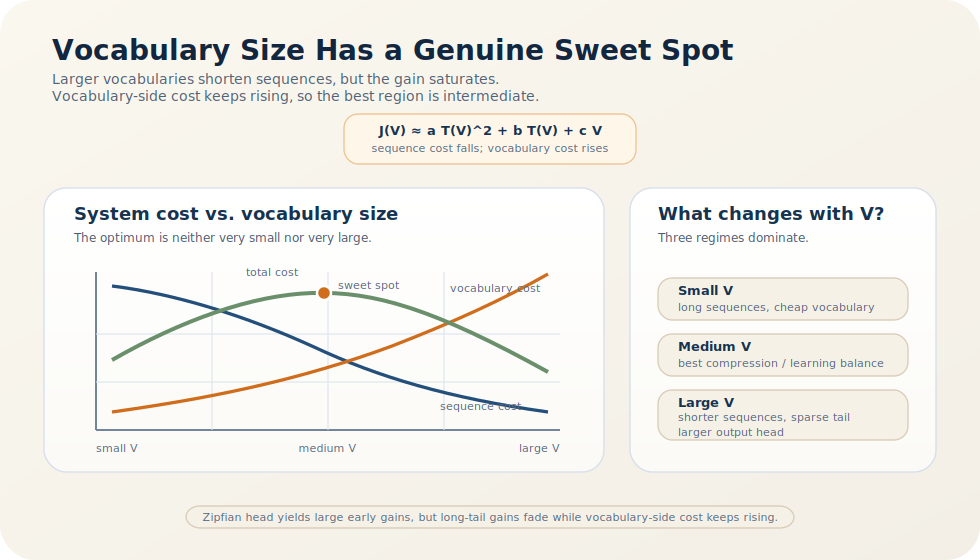

# LLM 词表规模的自然平衡点

既然 tokenizer 可以把高频局部结构收编进码本，一个看似自然的推论就是：词表越大越好，因为词表越大，序列就越短。现实并非如此。不同语言模型虽然词表并不完全一致，但在单语或近单语场景中，词表规模往往稳定落在一个中等区间，而不会无限扩张 [1-6]。

这不是经验巧合，而是系统层面的内点最优。扩大词表确实会缩短序列，但这一收益受 Zipf 长尾分布支配，很快出现边际递减；与此同时，词表参数、输出层成本与长尾 token 稀疏性却会持续上升。词表规模因此不应被理解为“越大越充分”的按钮，而应被理解为压缩收益与建模代价之间的平衡点。

> 核心结论：随着词表规模 $V$ 增长，平均序列长度 $T(V)$ 的确下降，但下降速度会因长尾分布而迅速减缓；相反，embedding 参数、输出层分类成本以及长尾 token 的学习稀疏性会近似随 $V$ 持续恶化。因此，现代 LLM 常在一个中等规模的 subword 词表附近达到更优的系统折中，而不会把所有低频片段都提升为独立 token [1-6]。

在“Tokenizer 的理论”系列中，本文承接上一篇 [Tokenization 的压缩本质](/blog/theory-of-tokenizers/what-tokenization-does)，把“码本为什么有用”推进到“码本该做到多大”；下一篇 [Character-Level Tokenizer 的理论优势与工程局限](/blog/theory-of-tokenizers/why-character-level-rarely-wins) 则检验把显式码本继续缩小到极限后会发生什么。

## 1. 先把问题写成一个成本平衡

设词表规模为 $V$，平均序列长度为 $T(V)$。对 Transformer 而言，一个粗略但有用的系统成本模型可以写成

$$
\mathcal{J}(V) \approx a\,T(V)^2 + b\,T(V) + c\,V,
$$

其中

- $a\,T(V)^2$ 代表 attention 这类随序列长度超线性增长的成本；
- $b\,T(V)$ 代表缓存、线性层和数据传输等长度相关成本；
- $c\,V$ 代表 embedding、输出层以及词表参数带来的规模成本。

这个式子并不试图精确拟合所有实现细节，但它抓住了关键结构：**增大词表可以减少长度成本，却会增加词表侧成本。** 问题因此不是要不要增大词表，而是继续增大是否仍然划算。

## 2. 为什么序列缩短的收益会迅速递减？

原因来自语言分布的长尾。Zipf 规律意味着，频率质量高度集中在头部少数单位，尾部则由大量低频片段构成 [1]。这会导致词表扩张呈现非常不均匀的收益曲线：

- 早期加入的高频 token 能显著缩短序列；
- 随着词表变大，新加入的 token 对应的片段越来越稀有；
- 到长尾区域时，新增词表项往往只替换极少出现的局部字符串。

因此，$T(V)$ 虽然单调下降，但其斜率绝不会保持不变，而是满足

$$
T'(V) < 0,
\qquad
|T'(V)| \to 0.
$$

这就是边际收益递减的数学表达。也正因为如此，词表扩张的前半段通常非常值钱，而后半段很快进入“成本上升、收益变小”的区域。

## 3. 为什么词表太大反而会伤害学习？

词表不是免费的压缩器。把越来越多低频片段提升为独立 token，会带来至少三类代价。

### 长尾参数稀疏

Sennrich 等人引入 subword 的核心理由之一，就是让长尾词由更高频片段组合表示，而不是为每个罕见词分配一个几乎学不到的独立向量 [2]。当词表过大时，尾部 token 的更新次数极低，embedding 很容易变成训练不足的参数孤岛。

### 输出层与 softmax 成本上升

下一 token 预测本质上是一个大小为 $V$ 的分类问题。即便工程上使用 fused kernel、采样近似或分块 softmax，词表扩张带来的输出头成本也不会凭空消失。

### 组合泛化被削弱

若某个低频字符串被硬编码为独立 token，模型就失去了通过高频子词共享统计规律的机会。对于长尾模式，组合已有子词常比训练罕见独立 token 更稳健。

因此，词表过大并不只是参数更多，而是会系统性制造尾部学习不均衡。

## 4. 为什么词表太小同样不可接受？

另一边，词表绝不能无限缩小。词表过小意味着 token 粒度过细，文本会被展开成更长序列。对 Transformer 而言，这会触发连锁效应：

- attention 计算更贵；
- KV cache 更大；
- 固定上下文窗口可容纳的真实文本更少；
- 模型必须花更多层数去先恢复词法块，再开始更高层的语义建模。

SentencePiece 把“在给定词表容量下学习最优分段”当成设计中心 [3]，这一点本身就说明：词表大小并非外围超参数，而是 tokenizer 训练时的一级约束。如果词表继续缩小到字符或字节级，模型就必须接手原本由显式码本承担的大量局部压缩工作 [6]。

## 5. 为什么中等规模会成为稳定工程解？

把前面两侧代价合起来，就会得到一个非常自然的结论：系统总成本更可能在某个中间区域达到低点。图 1 只是把这个结论画成曲线形式。

*图 1. 词表增大时，序列长度成本下降但边际收益递减；与此同时，词表参数、输出层和尾部稀疏代价持续上升，因此总成本更可能在中等区间出现低点。*

图 1 真正传达的是曲率而不是绝对数值：左侧下降很快，右侧上升更稳，中间因而出现低点。后面的分区表只是把这条连续曲线离散化成了更便于工程判断的三段区间。

可以把不同区间的状态概括为：

| 词表区间 | 主导问题 | 典型后果 |
| --- | --- | --- |
| 太小 | 序列过长，局部组合负担重 | 计算昂贵，上下文利用率低 |
| 中等 | 高频模式已被吸收，长尾仍可组合 | 压缩、泛化与学习稳定性较平衡 |
| 太大 | 尾部 token 稀疏，输出层与参数膨胀 | 额外收益很小，学习不均衡 |

这也是为什么 BERT 这类单语模型采用中等规模的 WordPiece 词表 [4]，而 SentencePiece 等工具也把固定容量码本作为默认接口 [3]。它们背后是同一条系统逻辑：词表必须足够大，以吸收头部统计结构；又必须足够小，以避免尾部拖累整个训练系统。

## 6. 为什么这个平衡点不是普适常数？

必须补上一条边界说明。`30k` 到 `50k` 只是许多单语或近单语场景下常见的经验区间，并不是理论常数。最佳词表会随数据与任务移动：

- 多语言模型需要覆盖更多脚本和形态变化，往往要求更大词表或不同字节策略；
- 代码模型面对标识符和符号串时，最优粒度与自然语言不同；
- 语料高度集中的垂直领域模型，有时可以用更小词表覆盖大部分头部模式；
- 字节级方案会把部分工作转移给更长序列处理，以换取开放性与鲁棒性 [6]。

因此，严格的结论不是“所有模型都该用 50k 词表”，而是：**在给定语料、架构和预算下，词表规模通常存在一个中间最优区域。**

## 7. 模型规模变化会把这个平衡点推向哪里？

还有一个更细的系统问题：随着模型规模、上下文长度和工程实现变化，这个平衡点会不会明显漂移？答案是会移动，但通常不会消失。

模型越大，长尾 token 往往越容易被学到，因此过大词表带来的稀疏惩罚会被部分缓解；上下文越长，每节省一个 token 的价值也越高，因此序列压缩收益会变得更显著。与此同时，更高效的 softmax kernel、分布式并行与推理缓存实现，也可能降低词表侧的部分工程成本。

但这些变化并不会改写 tradeoff 的基本形状。词表继续扩张时，收益仍然主要来自越来越尾部的片段，而尾部稀疏、参数增长和部署开销也依然存在。模型规模改变的，通常只是最优区间的具体位置，而不是“存在中间最优”这一事实本身。

## 8. 结语

词表规模之所以常停在一个中等区间，不是经验凑出来的折中，而是因为两侧代价具有完全不同的增长规律：序列缩短收益递减得很快，词表侧成本却上升得相当稳定。只要把 tokenizer 看成码本设计，这个结论几乎是必然的。

更紧凑地说，**词表大小不是局部超参数，而是整个语言模型系统如何分配压缩、参数与组合泛化负担的核心决策。** 把这条逻辑推进到极端，字符级路线就是最直接的检验场：如果继续缩小显式码本，系统到底会失去什么？

上一篇：[Tokenization 的压缩本质](/blog/theory-of-tokenizers/what-tokenization-does)。下一篇：[Character-Level Tokenizer 的理论优势与工程局限](/blog/theory-of-tokenizers/why-character-level-rarely-wins)。

## 参考文献

[1] PIANTADOSI S T. Zipf's Word Frequency Law in Natural Language: A Critical Review and Future Directions[J]. *Psychonomic Bulletin & Review*, 2014, 21(5): 1112-1130. DOI: [10.3758/s13423-014-0585-6](https://doi.org/10.3758/s13423-014-0585-6).

[2] SENNRICH R, HADDOW B, BIRCH A. Neural Machine Translation of Rare Words with Subword Units[C]// *Proceedings of the 54th Annual Meeting of the Association for Computational Linguistics (Volume 1: Long Papers)*. Berlin, Germany: Association for Computational Linguistics, 2016: 1715-1725. DOI: [10.18653/v1/P16-1162](https://doi.org/10.18653/v1/P16-1162).

[3] KUDO T, RICHARDSON J. SentencePiece: A Simple and Language Independent Subword Tokenizer and Detokenizer for Neural Text Processing[C]// *Proceedings of the 2018 Conference on Empirical Methods in Natural Language Processing: System Demonstrations*. Brussels, Belgium: Association for Computational Linguistics, 2018: 66-71. DOI: [10.18653/v1/D18-2012](https://doi.org/10.18653/v1/D18-2012).

[4] DEVLIN J, CHANG M-W, LEE K, et al. BERT: Pre-training of Deep Bidirectional Transformers for Language Understanding[C]// *Proceedings of the 2019 Conference of the North American Chapter of the Association for Computational Linguistics: Human Language Technologies, Volume 1 (Long and Short Papers)*. Minneapolis, Minnesota: Association for Computational Linguistics, 2019: 4171-4186. DOI: [10.18653/v1/N19-1423](https://doi.org/10.18653/v1/N19-1423).

[5] KUDO T. Subword Regularization: Improving Neural Network Translation Models with Multiple Subword Candidates[C]// *Proceedings of the 56th Annual Meeting of the Association for Computational Linguistics (Volume 1: Long Papers)*. Melbourne, Australia: Association for Computational Linguistics, 2018: 66-75. DOI: [10.18653/v1/P18-1007](https://doi.org/10.18653/v1/P18-1007).

[6] XUE L, BARUA A, CONSTANT N, et al. ByT5: Towards a Token-Free Future with Pre-trained Byte-to-Byte Models[J]. *Transactions of the Association for Computational Linguistics*, 2022, 10: 291-306. DOI: [10.1162/tacl_a_00461](https://doi.org/10.1162/tacl_a_00461).
